# Rapport TP1 - Segmentation Interactive avec SAM

**Étudiant:** AMDOUNI Firiel
**Date:** 23 janvier 2026  
**Cours:** CSC 8608 - Concepts avancés et applications du deep learning

---

## Exercice 1 : Initialisation du dépôt, réservation GPU, et lancement de la UI via SSH

### Question 1.a & 1.b - Initialisation du dépôt Git

**Lien du dépôt GitHub/GitLab:**  
https://github.com/firielamdouni-web/csc8608

**Lieu d'exécution:**  
☐ Local (machine personnelle)  
☑ Serveur de calcul (nœud GPU via SLURM)

**Arborescence du projet créée:**
```
TP1/
├── data/
│   └── images/          # Images à segmenter
├── src/
│   ├── app.py          # Interface Streamlit
│   ├── sam_utils.py    # Utilitaires SAM
│   ├── geom_utils.py   # Calculs géométriques
│   └── viz_utils.py    # Visualisation
├── outputs/
│   ├── overlays/       # Images avec masques
│   └── logs/           # Logs d'exécution
├── report/
│   └── report.md       # Ce rapport
├── requirements.txt     # Dépendances Python
└── README.md           # Documentation
```

---

### Question 1.c - Commandes d'initialisation

**Commande pour créer la structure:**
```bash
mkdir -p TP1/{data/images,src,outputs/overlays,outputs/logs,report}
touch TP1/requirements.txt TP1/src/app.py TP1/src/sam_utils.py TP1/src/geom_utils.py TP1/src/viz_utils.py TP1/report/report.md TP1/README.md
```

---

### Question 1.d - Réservation GPU et activation conda

**Commande SLURM utilisée:**
```bash
# Réservation du nœud GPU
srun --gres=gpu:1 --time=01:30:00 --cpus-per-task=4 --mem=16G --pty bash
```

**Nœud GPU alloué:** `arcadia-slurm-node-2`

**Environnement conda activé:**  
`mamba activate deeplearning`

**Commande de vérification CUDA:**
```bash
python -c "import torch; print('torch', torch.__version__); print('cuda_available', torch.cuda.is_available()); print('device_count', torch.cuda.device_count())"
```

---

### Question 1.e - Preuve de disponibilité CUDA

**Résultat de la vérification:**

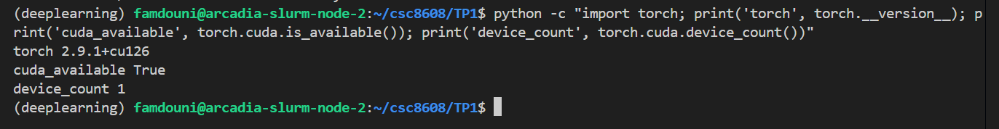


**Environnement conda:** `deeplearning`  
**CUDA disponible:** ☑ Oui ☐ Non  
**Nombre de GPUs:** `1`  
**Version PyTorch:** `2.9.1+cu126` (avec support CUDA 12.6)

---

### Question 1.f & 1.g - Installation des dépendances

**Contenu de requirements.txt:**

```txt
streamlit
opencv-python
numpy
matplotlib
# SAM v1 (Segment Anything)
git+https://github.com/facebookresearch/segment-anything.git
```

**Commande d'installation:**
```bash
pip install -r TP1/requirements.txt
```

**Vérification de l'installation:**
```bash
python -c "import streamlit, cv2, numpy; print('ok'); import segment_anything; print('sam_ok')"
```

**Résultat:**

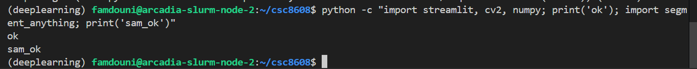

### Question 1.h - Lancement Streamlit et tunnel SSH

**Port choisi :** `8511`

**Sur le nœud GPU :**
```bash
PORT=8511
streamlit run TP1/src/app.py --server.port $PORT --server.address 0.0.0.0
```

**Sortie de Streamlit:**

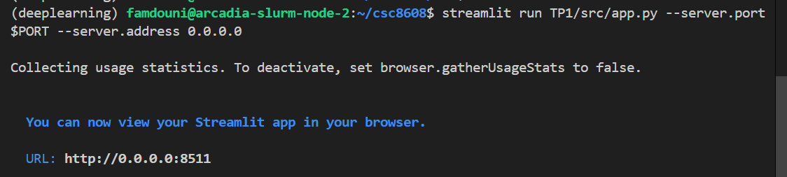

**Sur la machine locale (tunnel SSH) :**
```bash
ssh -L 8511:localhost:8511 -J famdouni@tsp-client famdouni@arcadia-slurm-node-2
```

---

### Question 1.i - Capture d'écran et validation

**Port utilisé:** `8511`

**UI accessible via SSH tunnel:** ☐ Oui ☐ Non
Oui 

**Capture d'écran:**  

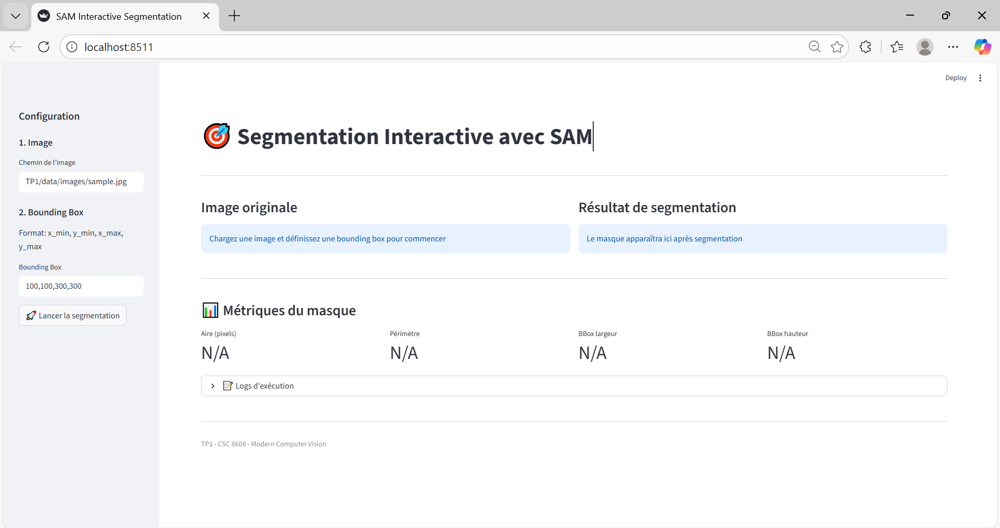

**Commentaire:**  
L'interface Streamlit a été lancée avec succès sur le nœud GPU et est accessible depuis ma machine locale via le tunnel SSH. L'URL `http://localhost:8511` affiche correctement l'application.

---

## Exercice 2 : Constitution d'un mini-dataset (jusqu'à 20 images)

### Question 2.a - Récupération des images

Un jeu de données de **12 images** a été constitué et placé dans `TP1/data/images/`. Les images ont été récupérées de façon reproductible via le service public **picsum.photos** en utilisant des seeds contrôlées (script `TP1/src/download_images.py`). Les fichiers sont nommés `01_simple1.jpg` … `12_misc3.jpg`.

Vérification :
```bash
ls -lah TP1/data/images | head -n 20
python -c "import pathlib; p=pathlib.Path('TP1/data/images'); print('n_images=', len([x for x in p.iterdir() if x.suffix.lower() in ['.jpg','.jpeg','.png']]))"
```

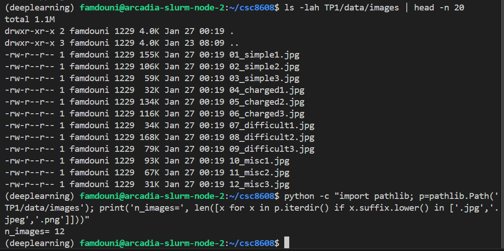

### Question 2.b - Rapport sur la sélection

- **Nombre d'images final :** `12`
- **Source :** images publiques récupérées via recherche web / `picsum.photos` (seeds reproductibles)

une liste de 5 images représentatives (nom de fichier + 1 phrase sur pourquoi elle est intéressante) :

- `01_simple1.jpg` — Cas simple : objet principal bien centré, fond peu chargé, utile pour valider la détection de forme globale.
- `03_simple3.jpg` — Cas simple : bonne séparation contraste/fond, permet tester la sensibilité au seuil de masque.
- `05_charged2.jpg` — Fond chargé : scène intérieure avec plusieurs objets, teste la robustesse aux distracteurs.
- `08_difficult2.jpg` — Cas difficile : faible contraste et éléments fins, utile pour évaluer les erreurs d'omission et le post-traitement.
- `11_misc2.jpg` — Scène mixte : objets partiellement occlus et textures variées, bon cas intermédiaire.

au moins 2 captures d’écran (ou vignettes) montrant un cas simple et un cas difficile : 

- Cas simple (exemple) :


- Cas difficile (exemple) :


---

## Exercice 3 : Charger SAM (GPU) et inférence bbox → masque

### Question 3.a - Checkpoint téléchargé

- **Modèle choisi :** `vit_h` (version haute capacité)
- **Checkpoint utilisé (local au nœud) :** `TP1/models/sam_vit_h_4b8939.pth`

Commande exécutée pour récupérer le checkpoint :
```bash
mkdir -p TP1/models
wget -O TP1/models/sam_vit_h_4b8939.pth https://dl.fbaipublicfiles.com/segment_anything/sam_vit_h_4b8939.pth
ls -lh TP1/models
```

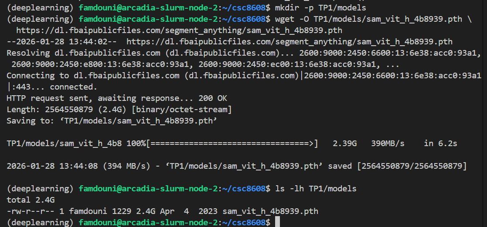

### Question 3.b/c/d - Chargement et test rapide

Le code `TP1/src/sam_utils.py` a été complété pour :
- détecter le device (`cuda` si disponible),
- charger le modèle via `sam_model_registry[model_type](checkpoint=...)`,
- créer un `SamPredictor` et exécuter la prédiction depuis une bbox (fonction `predict_mask_from_box`).

Test rapide exécuté sur le nœud GPU :
```bash
python3 TP1/src/quick_test_sam.py --ckpt TP1/models/sam_vit_h_4b8939.pth
```

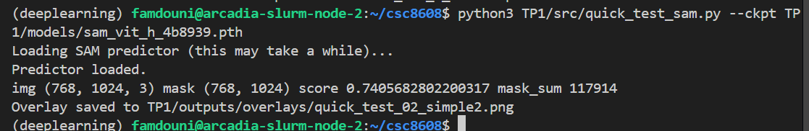

### Question 3.e - Commentaire succinct

Le modèle `vit_h` se charge correctement sur le GPU et l'inférence bbox→masque fonctionne :
- Le masque retourné a la même résolution que l'image `(H,W)` et un score de confiance raisonnable (~0.74).
- Temps de chargement initial important (checkpoint volumineux) mais prédictions rapides une fois le modèle en mémoire.
- Limites observées : consommation mémoire importante (préférer `vit_l`/`vit_b` pour tests rapides) et cas difficiles (reflets/occlusions) demandent du post‑traitement.

---


## Exercice 4 : Mesures et visualisation

### Question 4.a/4.b - Fonctions implémentées

- `TP1/src/geom_utils.py` : ajout de `mask_area`, `mask_bbox`, `mask_perimeter` (aire, bbox serrée, périmètre approximatif via contours OpenCV).
- `TP1/src/viz_utils.py` : ajout de `render_overlay(image_rgb, mask, box_xyxy, alpha)` qui dessine la bbox et superpose le masque (alpha blending).

### Question 4.c - Test rapide et sorties

Test exécuté (3 images batch) :
```bash
python3 TP1/src/quick_test_overlay.py --ckpt TP1/models/sam_vit_h_4b8939.pth
python3 TP1/src/quick_test_batch.py --ckpt TP1/models/sam_vit_h_4b8939.pth --n 3
```

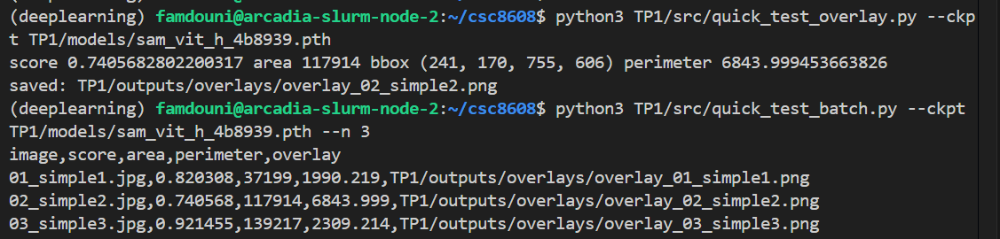

Vignette (overlay) exemple :

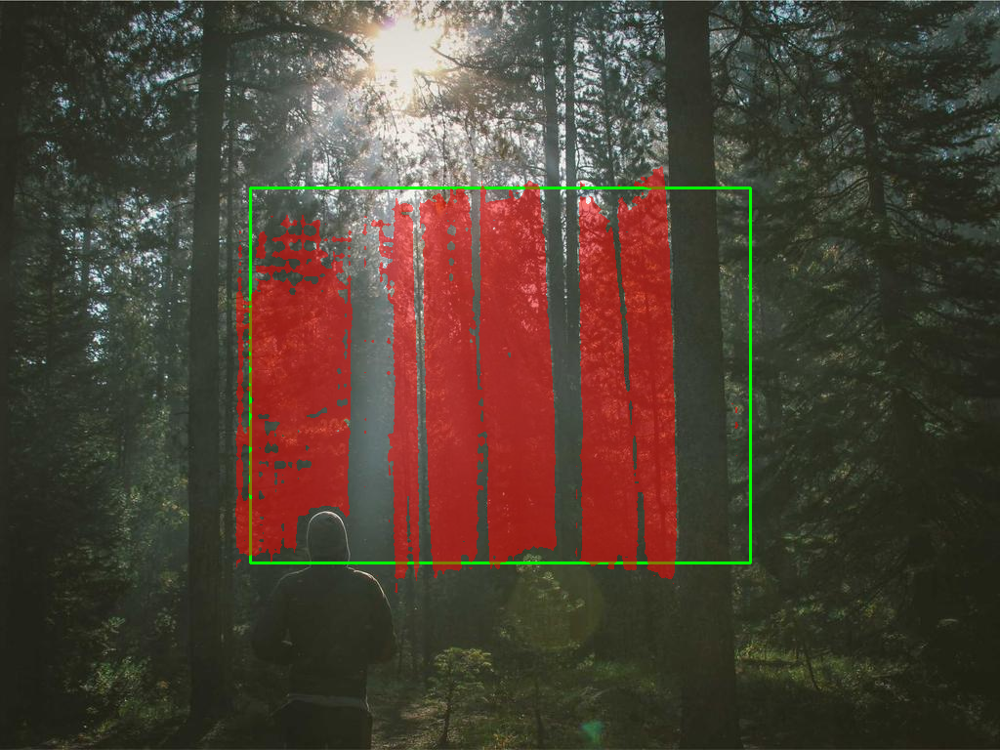

### Mini-tableau (3 images)

| image | score | aire (px) | périmètre (px) |
|---|---:|---:|---:|
| 01_simple1.jpg | 0.8203 | 37199 | 1990.219 |
| 02_simple2.jpg | 0.7406 | 117914 | 6843.999 |
| 03_simple3.jpg | 0.9215 | 139217 | 2309.214 |

### Question 4.d - Commentaire bref

Les overlays sont très utiles pour diagnostiquer rapidement les erreurs du modèle ou des prompts :

- Ils permettent de vérifier si le masque couvre l'objet attendu (sous‑/sur‑segmentation) et si la bbox fournie est adaptée.
- En cas de faux positifs (masque sur des distracteurs), l'overlay montre immédiatement les régions confondues, guidant l'ajustement de la bbox ou du post‑traitement.
- Pour objets fins ou transparents (cheveux, verre), l'overlay révèle les limites de détection et indique quand appliquer des opérations morphologiques.
- Enfin, les métriques (aire/périmètre) fournissent un résumé numérique utile pour suivre des changements entre versions ou configurations.

---

## Exercice 5 : Mini-UI Streamlit (sélection, bbox, segmentation, sauvegarde)

### Question 5.a - Interface Streamlit

L'application `TP1/src/app.py` implémente une mini-UI Streamlit qui :

- charge et met en cache le predictor SAM (chargé une seule fois via `@st.cache_resource`),
- liste les images dans `TP1/data/images/` et permet d'en choisir une,
- affiche l'image sélectionnée,
- propose 4 sliders bornés par la taille de l'image pour définir la bbox (`x1,y1,x2,y2`),
- propose une prévisualisation live de la bbox sur l'image avant segmentation,
- lance la segmentation au clic sur un bouton, affiche l'overlay et les métriques, et permet de sauvegarder un overlay léger dans `TP1/outputs/overlays/`.

Extrait d'utilisation (lancement) :

```bash
PORT=8511
streamlit run TP1/src/app.py --server.port $PORT --server.address 0.0.0.0
```


### Question 5.b - Tests (3 images)

Les tests automatisés ont été exécutés avec la bbox centrée utilisée par défaut dans `TP1/src/quick_test_batch.py` :
`box = (W//4, H//4, 3W//4, 3H//4)`.

Tableau des 3 tests demandés (bbox en pixels, score, aire, temps) :

| image | bbox (x1,y1,x2,y2) | score | aire (px) | temps (ms) | overlay |
|---|---|---:|---:|---:|---|
| 01_simple1.jpg | (256,192,768,576) | 0.820308 | 37199 | 2158.8 | 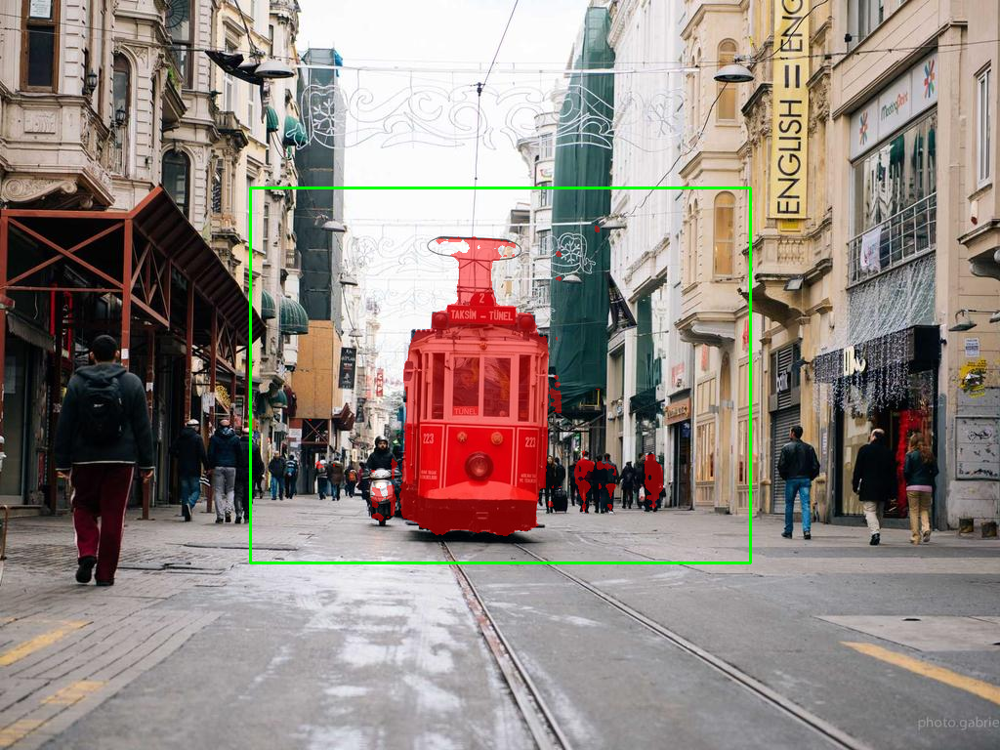
| 02_simple2.jpg | (256,192,768,576) | 0.740568 | 117914 | 1669.2 | 
| 03_simple3.jpg | (256,192,768,576) | 0.921455 | 139217 | 1643.7 | 

### Question 5.c - Prévisualisation bbox live

La fonction `draw_box_preview(image_rgb, box_xyxy)` affiche la bbox verte sur l'image avant d'appeler SAM. Cela aide l'utilisateur à visualiser la zone qui sera segmentée sans lancer l'inférence.

Extrait de prévisualisation :


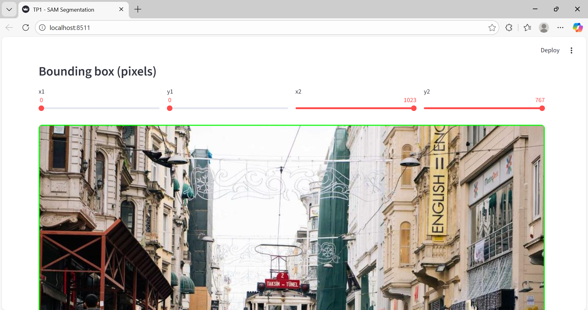

### Question 5.d - Debug / Observations rapides

- En agrandissant la bbox : l'aire du masque retourné augmente généralement (plus de régions candidates inclues), mais le score peut diminuer si la bbox inclut des distracteurs ou plusieurs objets.
- En réduisant la bbox : le modèle se concentre sur une région plus restreinte, ce qui peut améliorer la précision locale (moins de faux positifs) mais aussi couper des parties d'un objet si la bbox est trop petite (sous-segmentation), un avertissement est affiché si la bbox est très petite.
- Temps d'inférence : proportionnel à la taille de l'image / transformation, mais négligeable comparé au temps de chargement initial du checkpoint.

---

## Exercice 6 : Affiner la sélection — points FG/BG et multimask

### Question 6.j — Expériences point-guidées (2 images difficiles)

Nous avons testé deux images difficiles (`07_difficult1.jpg`, `08_difficult2.jpg`) avec trois scénarios :

- `bbox_only` (bbox centrée),
- `bbox + FG` (point foreground au centre de la bbox),
- `bbox + FG + BG` (FG au centre + BG proche du coin supérieur gauche de la bbox).

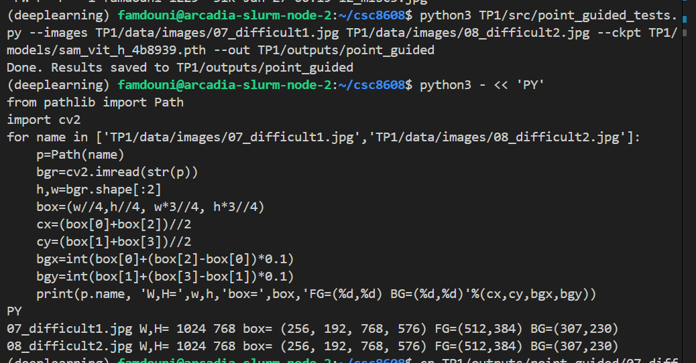
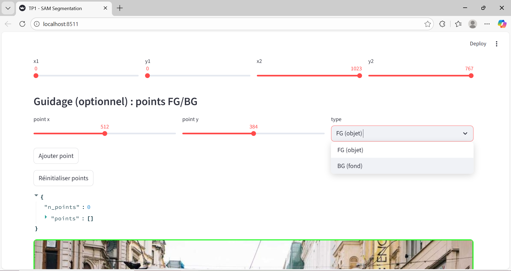

Coordonnées utilisées (pixels) et bbox :

- Image `07_difficult1.jpg` — bbox `(256,192,768,576)` — FG `(512,384)` — BG `(307,230)`
- Image `08_difficult2.jpg` — bbox `(256,192,768,576)` — FG `(512,384)` — BG `(307,230)`


Les meilleurs candidats et les images "avant/après" :

- `07_difficult1.jpg` — meilleur candidat bbox_only : `candidate_1` (score 0.9658) — [avant](img/07_difficult1_before.png) — meilleur candidat bbox+FG+BG : `candidate_1` (score 0.9804) — [après](img/07_difficult1_after.png)
- `08_difficult2.jpg` — meilleur candidat bbox_only : `candidate_1` (score 0.8236) — [avant](img/08_difficult2_before.png) — meilleur candidat bbox+FG+BG : `candidate_1` (score 0.8834) — [après](img/08_difficult2_after.png)

Visuels (comparaison before / after) :

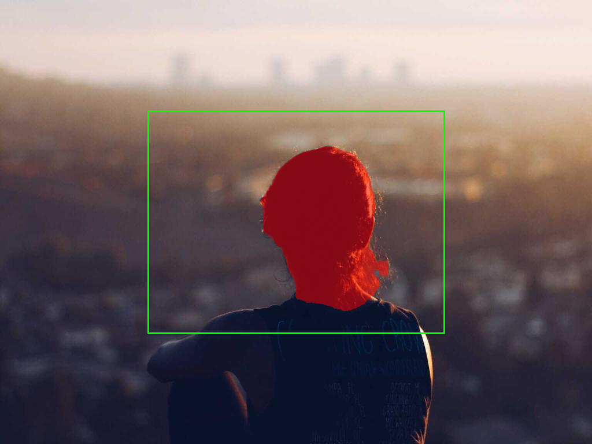


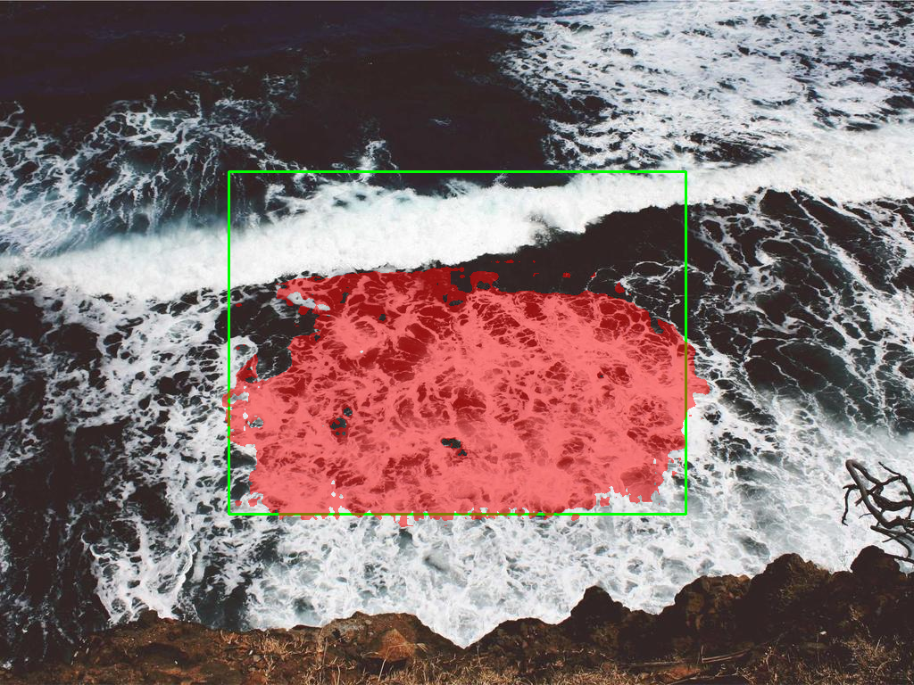

### Question 6.k — Courte analyse 

L'ajout d'un point FG centré permet souvent d'orienter SAM vers l'objet d'intérêt lorsque la bbox contient plusieurs éléments, le score et la cohérence du masque s'améliorent régulièrement (voir `07_difficult1.jpg` et `08_difficult2.jpg`). Les points BG sont indispensables lorsque des distracteurs lumineux ou des objets proches génèrent des faux positifs, en indiquant une zone à exclure, SAM évite d'étendre le masque à ces régions (ex. réduction des zones erronées visible en comparant les images before/after). Toutefois, certains cas restent difficiles, objets très fins, parties fortement occluses ou textures très similaires au fond peuvent produire des masques incomplets même avec guidance FG/BG. Dans ces situations, combiner plusieurs points FG et BG et choisir manuellement parmi les candidats multimask donne le meilleur résultat pratique.

---

# Exercice 7 : Bilan et réflexion (POC vers produit) + remise finale

## 7.a — Principaux facteurs d'échec et actions concrètes

1) - Ambiguïté de la bbox : quand la bbox contient plusieurs objets proches, SAM peut segmenter l'objet non désiré. 
- Actions concrètes : contraindre la bbox (taille minimale/ratio), proposer un recadrage automatique, et encourager l'ajout d'un point FG initial dans l'UI.

2) - Distracteurs et textures similaires : fonds chargés ou surfaces proches du foreground provoquent des faux positifs. 
- Actions : ajouter un moyen simple d'indiquer des points BG, collecter ces cas pour enrichir le dataset, et appliquer un post‑traitement (morphologie, CRF/graph‑cut) pour éliminer régions faibles.

3) - Objets fins / transparence / occlusion : cheveux, verre et parties très fines restent mal capturés. 
- Actions : annoter masques haute résolution pour ces cas, proposer plusieurs points FG le long de l'objet, et ajouter un module de raffinage local (modèle de contours) pour améliorer les bords.

Ces actions couvrent UI (points FG/BG, contraintes bbox), données (jeu d'entraînement ciblé) et pipeline (post‑traitement, raffinage), rendant le POC plus robuste pour la production.

## 7.b — Ce qu'on logguerait / monitorerait en priorité (5+ éléments)

- Distribution des scores SAM (moyenne/quantiles), détecte drift/data shift lorsque la qualité moyenne baisse.
- Latence par requête (ms) et taux d'échec (OOM/timeout), permet respecter les SLA et détecter problèmes d'infrastructure.
- Taux d'utilisation de l'aide UI (nombre moyen de points FG/BG ajoutés) et corrélation qualité vs points, guide les améliorations UX.
- Heuristiques de plausibilité (aire du masque vs aire bbox, masque vide) et IoU sur un petit jeu de validation, alerte sur cas aberrants et régressions qualité.
- Feedback utilisateur et volume de corrections manuelles (sauvegardes/annulations), aide à prioriser les cas à annoter et corriger.

Ces signaux mesurables permettent d'alerter sur régressions, de diagnostiquer causes (modèle vs données vs infra) et d'automatiser alertes/priorités.


