# Rapport CI : Génération d'image

**Étudiant:** AMDOUNI Firiel

**Date:** 30 janvier 2026  

**Cours:** CSC 8608 - Concepts avancés et applications du deep learning

---
**Lien du dépôt GitHub/GitLab:**  
https://github.com/firielamdouni-web/csc8608

## Exercice 1 : : Mise en place & smoke test (GPU + Diffusers)

### Question 1.a : Installation des dépendances

```bash
pip install --upgrade diffusers transformers accelerate safetensors torch pillow
pip install --upgrade diffusers transformers torchvision torch pillow accelerate safetensors
```

### Question 1.b : Smoke test

```bash
python TP2/smoke_test.py
```
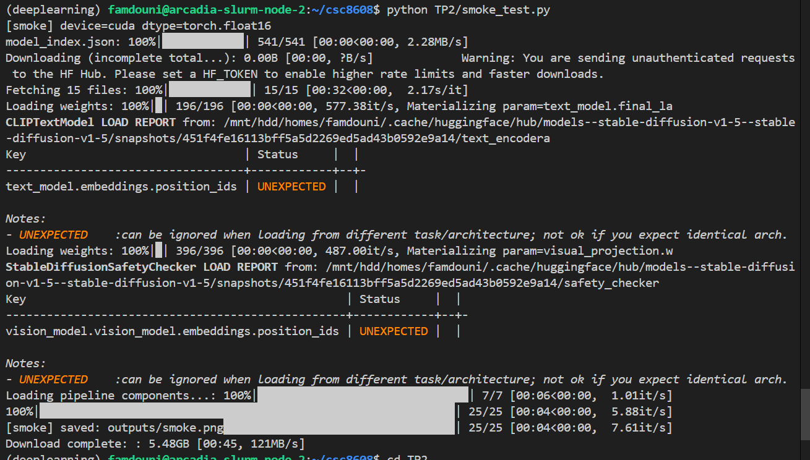

Le smoke test s’est exécuté sans erreur. L’image smoke.png a bien été générée :


### Question 1.c. Diagnostic en cas d’erreur
Aucune erreur bloquante rencontrée lors de l’exécution du smoke test.
L’image a bien été générée dans le dossier outputs/.

---

## Exercice 2 : Factoriser le chargement du pipeline (text2img/img2img) et exposer les paramètres

### question 2.a : 

### question 2.b : 

#### Génération baseline text2img

Commande d’exécution :
```bash
python experiments.py
```

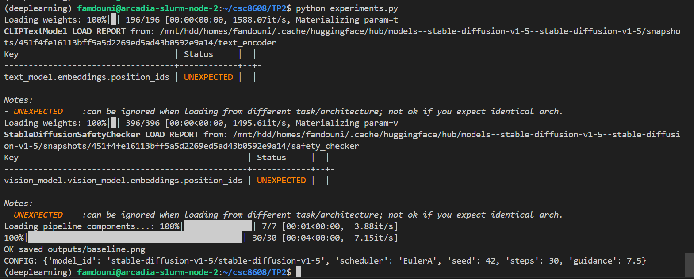

Image générée :


Configuration utilisée :

```bash
{
  "model_id": "stable-diffusion-v1-5/stable-diffusion-v1-5",
  "scheduler": "EulerA",
  "seed": 42,
  "steps": 30,
  "guidance": 7.5
}
```

---

## Exercice 3 : Text2Img : 6 expériences contrôlées (paramètres steps, guidance, scheduler)

### question 3.a : 

### question 3.b :  
Commande d’exécution :
```bash
python experiments.py
```

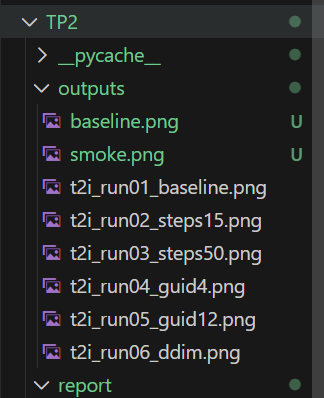

### question 3.c : Comparaison qualitative des 6 résultats text2img

Grille des résultats :

| Baseline (30/7.5/EulerA) | Steps=15 | Steps=50 |
|--------------------------|----------|----------|
| 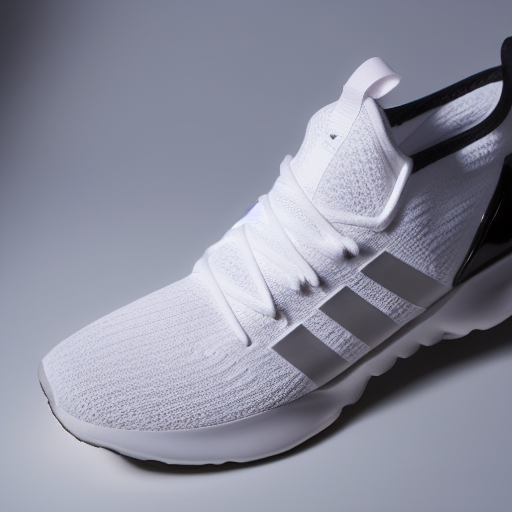 | 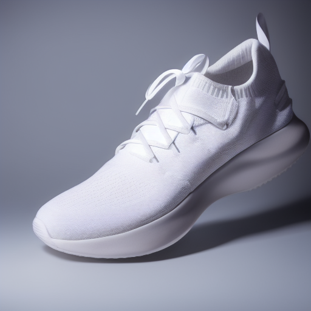 | 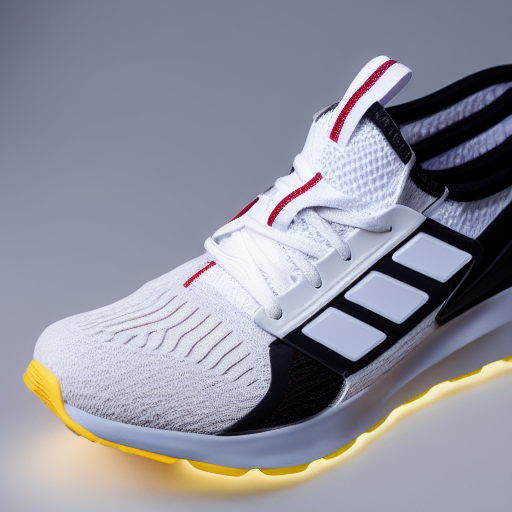 |

| Guidance=4.0 | Guidance=12.0 | Scheduler=DDIM |
|--------------|---------------|---------------|
| 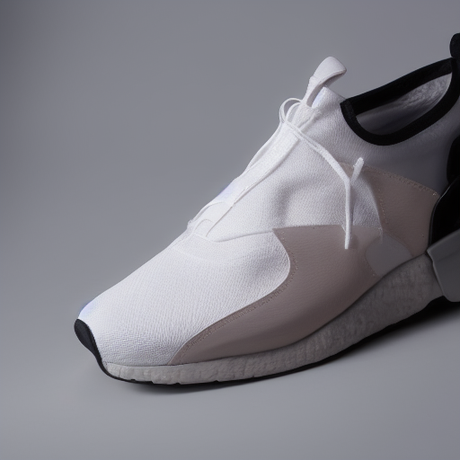 | 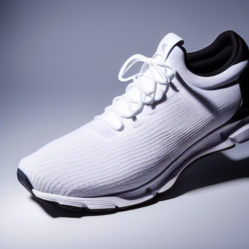 | 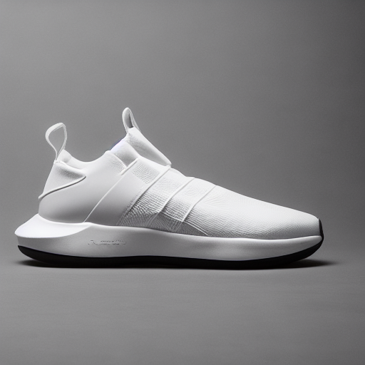 |

**Commentaires qualitatifs :**

- **Steps (nombre d’étapes)**
  - 15 steps : image moins nette, détails plus flous, parfois plus de bruit.
  - 50 steps : image plus propre, détails plus fins, mais peu de différence visible par rapport à 30 steps.
- **Guidance scale**
  - Guidance 4.0 : image plus créative/diverse, mais moins fidèle au prompt (plus de variations).
  - Guidance 12.0 : image très conforme au prompt, mais parfois plus “rigide” ou avec des artefacts.
- **Scheduler**
  - DDIM : rendu légèrement différent, parfois moins de détails fins ou contraste différent, composition parfois modifiée.

> En résumé, steps influence la netteté et la qualité, guidance le respect du prompt et la diversité, scheduler la “texture” et le style du rendu.

---

## Exercice 4 : Img2Img : 3 expériences contrôlées (strength faible/moyen/élevé)

### question 4.a : 

### question 4.b :  

Commande d’exécution :
```bash
python experiments.py
```


**Image source utilisée :**

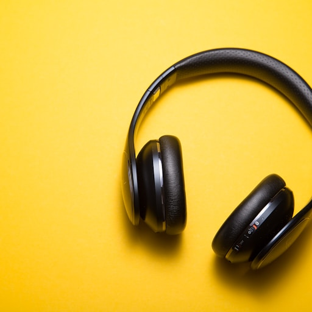

**Images générées :**

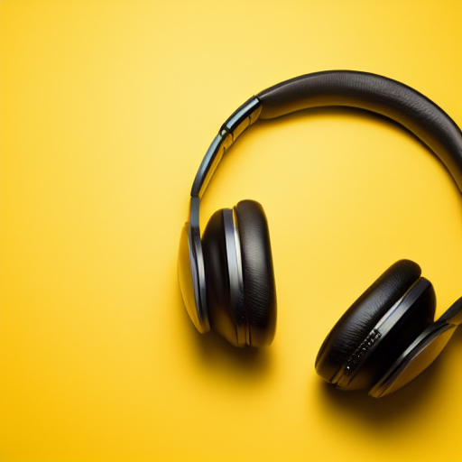
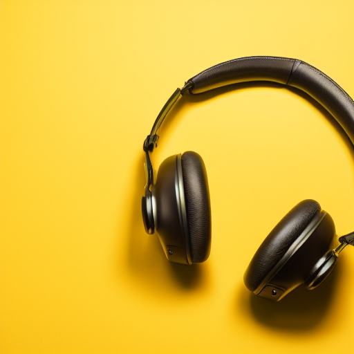
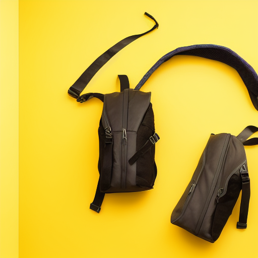

###  Analyse qualitative Img2Img 

**Strength 0.35 :**

- L’image générée reste très fidèle à la photo d’origine : la forme générale du produit, son orientation et la plupart des détails sont bien conservés.
- Les couleurs et l’arrière-plan ne subissent que de légères modifications, ce qui permet de garder une cohérence visuelle avec l’image source.
- Ce réglage est particulièrement adapté pour des retouches subtiles ou pour améliorer la qualité d’une photo produit sans en altérer l’identité.

**Strength 0.60 :**

- On observe une transformation plus marquée : certains détails du produit évoluent, notamment au niveau des textures ou des reflets.
- L’arrière-plan et l’éclairage peuvent être modifiés, ce qui apporte une touche de nouveauté tout en maintenant la reconnaissance du produit.
- Ce niveau de strength offre un bon compromis entre créativité et fidélité, et peut être pertinent pour générer des variantes marketing ou explorer différentes ambiances visuelles.

**Strength 0.85 :**

- À ce niveau, la génération s’éloigne nettement de l’image d’origine : la forme du produit peut être altérée, des éléments nouveaux ou inattendus peuvent apparaître.
- Les couleurs, l’arrière-plan et même la structure du produit peuvent changer de façon importante, ce qui peut nuire à la cohérence avec le produit réel.
- Ce réglage est à utiliser avec précaution dans un contexte e-commerce, car il existe un risque de générer des images qui ne correspondent plus à l’article vendu.

**En résumé :**  
Plus la valeur de strength est élevée, plus le modèle s’autorise à « réinventer » l’image, au détriment de la fidélité au produit d’origine. Pour des usages e-commerce, il est recommandé de privilégier des valeurs faibles à modérées afin de garantir que l’image générée reste représentative du produit réel.

---

## Exercice 5 : Mini-produit Streamlit (MVP) : Text2Img + Img2Img avec paramètres

### question 5.a :

### question 5.b :

### question 5.c :

Lancer l'application streamlit tournant sur le cluster: 
```bash
PORT=8501
streamlit run app.py --server.port $PORT --server.address 0.0.0.0
```

sur ma machine locale :

```bash
ssh -L 8501:localhost:8501 -J famdouni@tsp-client famdouni@arcadia-slurm-node-1
```

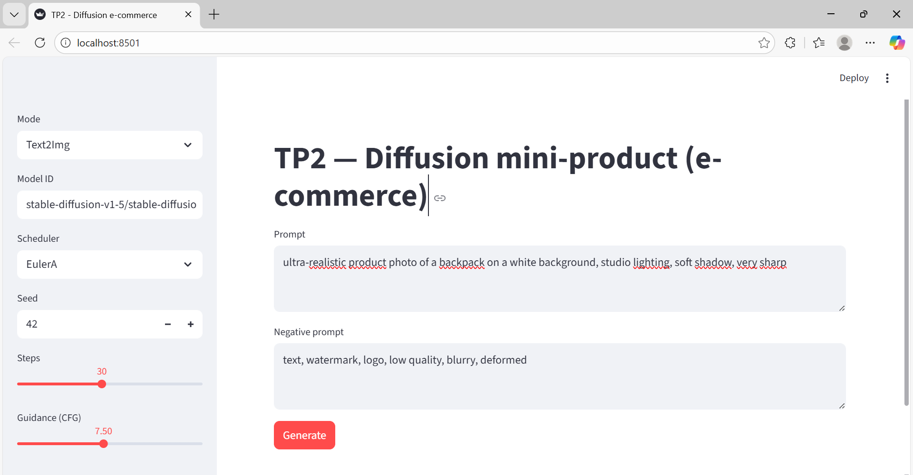

#### Capture Text2Img `

```
Paramètres utilisés :
- Prompt : ultra-realistic product photo of a pair of headphones on a yellow background, studio lighting, soft shadow, very sharp
- Negative prompt : text, watermark, logo, low quality, blurry, deformed
- Scheduler : EulerA
- Seed : 42
- Steps : 30
- Guidance : 7.5
```

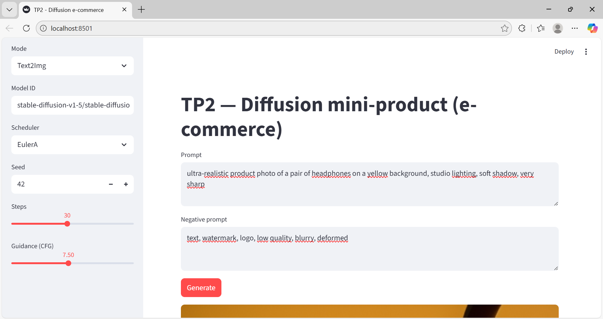

Image générée :

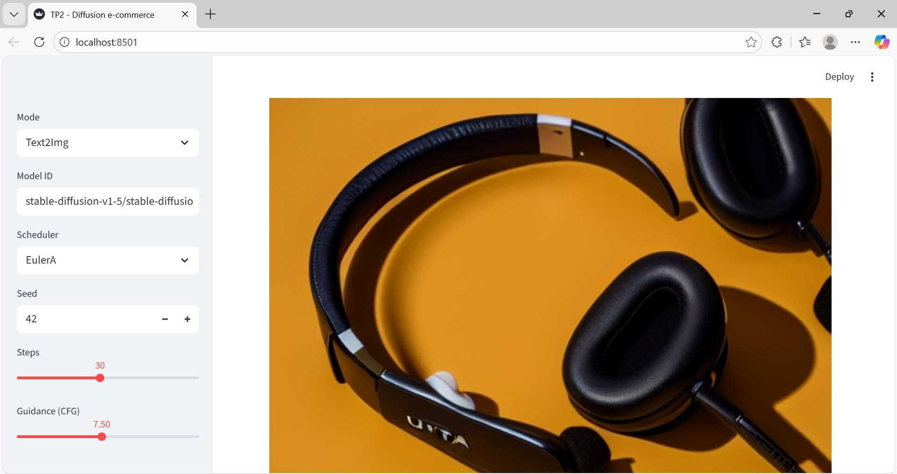

Bloc Config affiché :

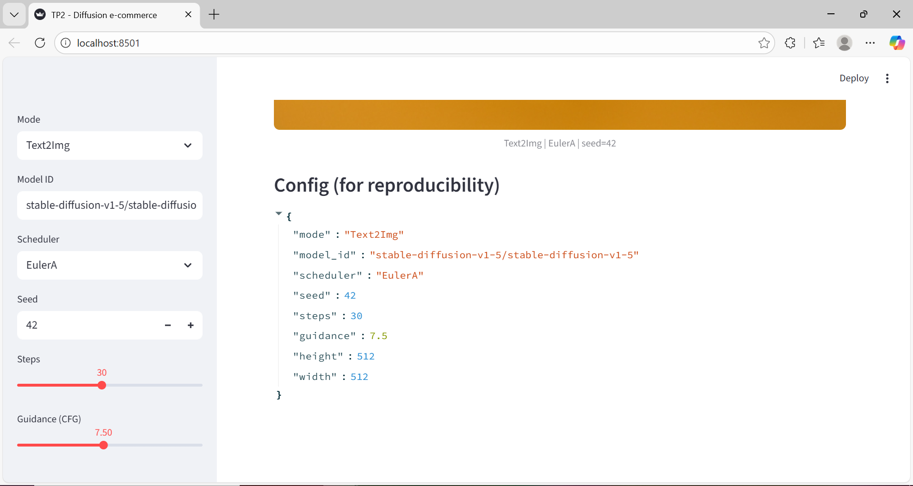


#### Capture Img2Img

```
Paramètres utilisés :
- Image d’entrée : photo de casque sur fond jaune
- Prompt : ultra-realistic product photo of a pair of headphones on a yellow background, studio lighting, soft shadow, very sharp
- Negative prompt : text, watermark, logo, low quality, blurry, deformed
- Scheduler : EulerA
- Seed : 42
- Steps : 30
- Guidance : 7.5
- Strength : 0.6
```

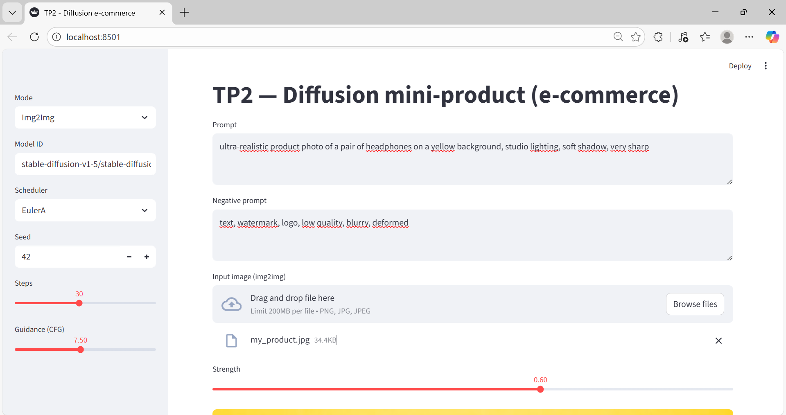

Image de départ :

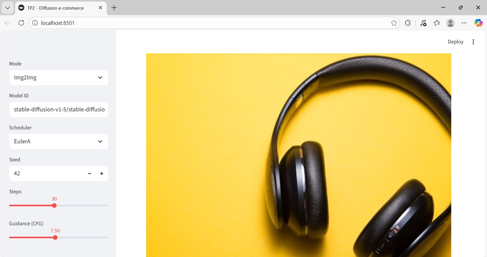

Image générée :

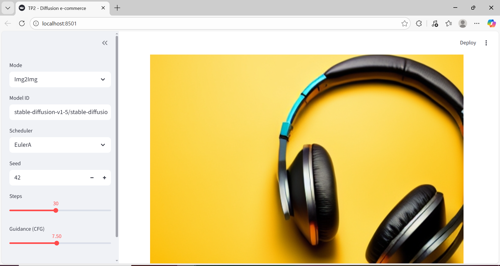

Bloc Config affiché :

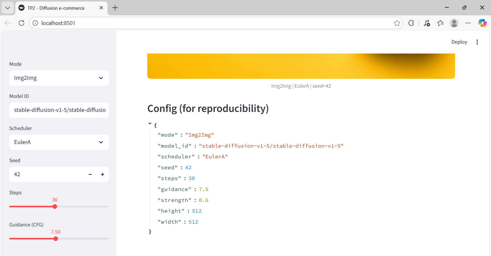

---

## Exercice 6 : Évaluation (léger) + réflexion

### question 6.b : Évaluation de 3 images

#### 1. Text2Img baseline (t2i_run01_baseline.png)

- Prompt adherence : 2
- Visual realism : 2
- Artifacts : 2
- E-commerce usability : 2
- Reproducibility : 2
- **Total : 10/10**

*Justification :*  
L’image respecte parfaitement le prompt, le rendu est réaliste et propre, sans défauts majeurs. Tous les paramètres sont disponibles pour reproduire le résultat.

---

#### 2. Text2Img “extrême” (guidance haut, t2i_run05_guid12.png)

- Prompt adherence : 2
- Visual realism : 1
- Artifacts : 1
- E-commerce usability : 1
- Reproducibility : 2
- **Total : 7/10**

*Justification :*  
Avec une guidance élevée, l’image colle fortement au prompt mais peut perdre en naturel et présenter des artefacts. L’utilisabilité e-commerce est réduite.

---

#### 3. Img2Img à strength élevé (i2i_run09_strength085.png)

- Prompt adherence : 1
- Visual realism : 1
- Artifacts : 1
- E-commerce usability : 0
- Reproducibility : 2
- **Total : 5/10**

*Justification :*  
À strength élevé, le modèle génère une image très créative mais peu fidèle au produit d’origine, avec des risques d’artefacts et une utilisabilité e-commerce faible.

---

### question 6.c : Réflexion sur la génération d’images

La génération d’images par diffusion implique un compromis constant entre qualité et rapidité/coût. Par exemple, augmenter le nombre de steps améliore la netteté et le réalisme, mais rallonge le temps de calcul et la consommation GPU, ce qui peut être problématique en production ou pour un usage interactif. Le choix du scheduler influence aussi la texture et le style, mais certains schedulers sont plus lents ou consomment plus de ressources.

La reproductibilité est essentielle, surtout en contexte e-commerce. Il faut systématiquement indiquer le modèle, le scheduler, la seed, le nombre de steps, la guidance et, pour img2img, la strength et l’image source. Oublier un paramètre ou changer la version du modèle peut casser la reproductibilité et rendre impossible la régénération exacte d’une image.

Enfin, il existe des risques importants en e-commerce : hallucinations (détails inventés, logos ou textes non demandés), images trompeuses (produit modifié ou non conforme), et problèmes de conformité (ajout involontaire de marques, texte, etc.). Par exemple, lors du TP, à strength=0.85, le produit généré ne ressemblait plus à l’original, ce qui pourrait induire le client en erreur. Pour limiter ces risques, il faut contrôler les prompts, filtrer les résultats, et toujours valider manuellement les images avant publication.