# Rapport CI : Deep learning pour audio

## Exercice 1 : : Initialisation du TP3 et vérification de l’environnement

### Question 1.a : 

### Question 1.b :  

TP3/run_sanity.sh
Les deux trous complétés :

```bash
gpu_name   = torch.cuda.get_device_name(0)
gpu_mem_gb = torch.cuda.get_device_properties(0).total_memory / (1024**3)
```

### Question 1.c : 

Commande d'exécution :

```bash
srun --gres=gpu:1 --time=3:00:00 --cpus-per-task=4 --mem=16G --pty bash
mamba activate deeplearning
python TP3/sanity_check.py
```

Sortie obtenue :


---

## Exercice 2 : Constituer un mini-jeu de données : enregistrement d’un “appel” (anglais) + vérification audio

### Question 2.a : 
L'audio a été enregistré via [online-voice-recorder.com](https://online-voice-recorder.com/),
en lisant le texte fourni.
Le fichier source a été converti en WAV mono 16 kHz pour garantir la compatibilité
avec les modèles ASR utilisés dans la suite du TP.

### Question 2.b :  
Vérification du fichier audio : 

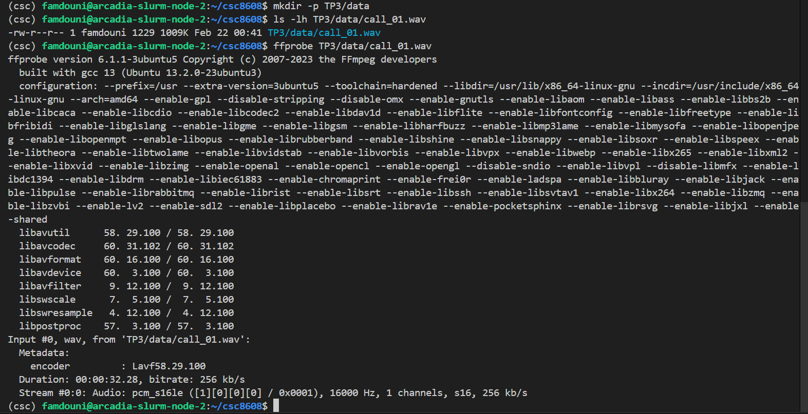

### Question 2.c : 

```bash
ffmpeg -i TP3/data/call_01.mp3 -ac 1 -ar 16000 TP3/data/call_01.wav
```

### Question 2.d :  
Script inspect_audio.py complété.
wav.shape retourne [1, num_samples] après le mean(dim=0, keepdim=True).
L'indice 1 correspond donc au nombre d'échantillons temporels.

### Question 2.e : 

```bash
python TP3/inspect_audio.py
```

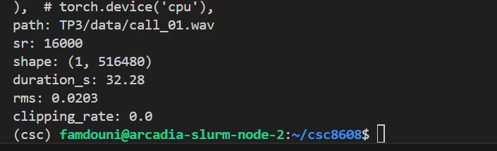

---

## Exercice 3 : VAD (Voice Activity Detection) : segmenter la parole et mesurer speech/silence

### Question 3.a :  
Installation de silero-vad :
```bash
pip install silero-vad
```

sampling_rate=16000 correspond au taux d'échantillonnage de l'audio chargé
et au format attendu par le modèle silero-vad.

### Question 3.b : 

```bash
python TP3/vad_segment.py
cat TP3/outputs/vad_segments_call_01.json | head -n 60
```
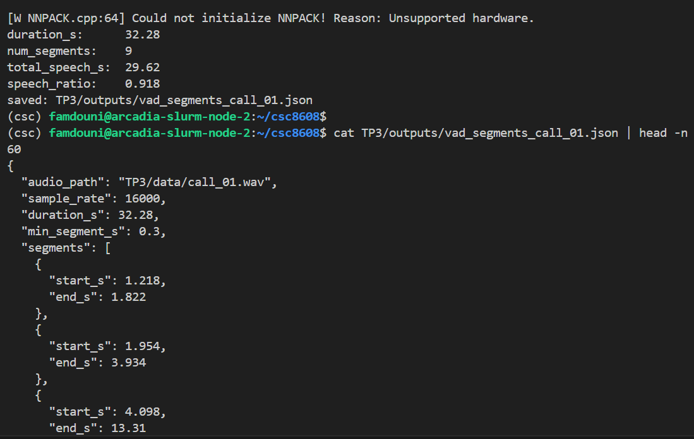
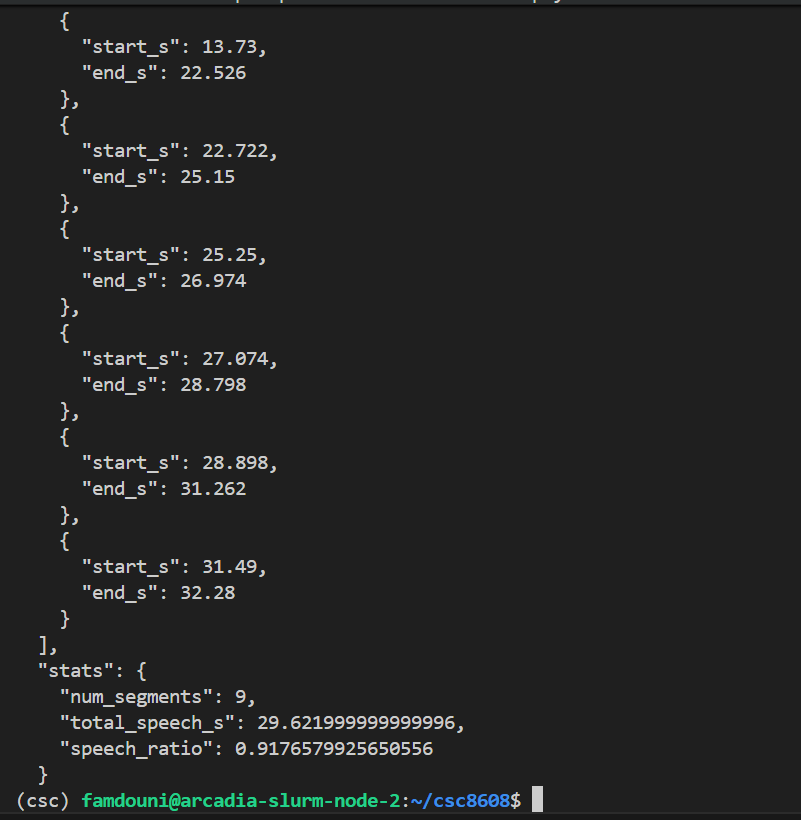

### Question 3.c : 
```python
min_dur_s = 0.60 
```

Le ratio obtenu de **0.918** signifie que 91.8% de l'audio est détecté comme de la parole active. C'est cohérent avec la façon dont le texte a été lu, la lecture était continue, avec de très courtes pauses entre les phrases.
Les 9 segments détectés correspondent bien aux groupes de phrases du script, avec quelques pauses de respiration visibles (ex. entre 3.93s et 4.10s,
entre 22.53s et 22.72s). Le VAD ne semble ni trop sensible ni trop permissif
sur cet enregistrement.

### Question 3.d : 

En passant de 0.30 à 0.60, num_segments reste inchangé à 9 et speech_ratio reste stable à 0.918. Cela s'explique par le fait que tous les segments détectés ont déjà une durée supérieure à 0.60s, le plus court étant d'environ 0.60s (1.218s → 1.822s). Le filtrage à 0.30s était donc déjà suffisant pour cet enregistrement. 

---

## Exercice 4 : ASR avec Whisper : transcription segmentée + mesure de latence

### Question 4.a. 

### Question 4.b.

```bash
python TP3/asr_whisper.py
```
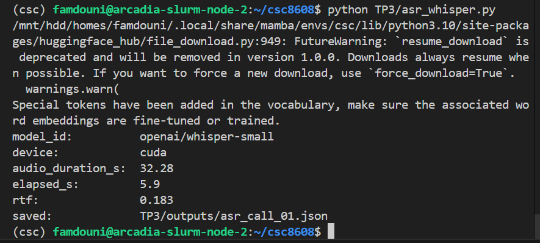

RTF = 0.183 : la transcription est ~5.5× plus rapide que la durée audio réelle, ce qui est très satisfaisant pour un usage production.
Un RTF < 1.0 est l'objectif minimal ; ici on est largement en dessous.

### Question 4.c. 
Extrait des 5 premiers segments :

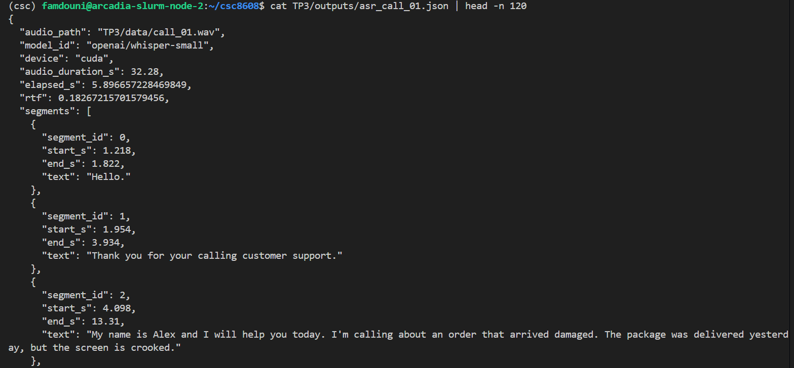
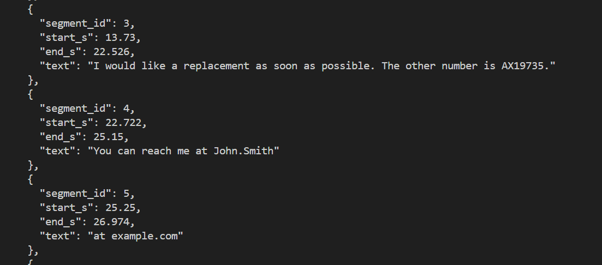

Extrait du full_text :
 "full_text": "Hello. Thank you for your calling customer support. My name is Alex and I will help you today. I'm calling about an order that arrived damaged. The package was delivered yesterday, but the screen is crooked. I would like a replacement as soon as possible. The other number is AX19735. You can reach me at John.Smith at example.com Also my phone number is 5550199 Thank you."

### Question 4.d. 

Analyse de la segmentation VAD et transcription : 

La segmentation VAD aide globalement la transcription en évitant que Whisper dérive sur les silences. Cependant, elle introduit quelques artefacts notables, le segment 0 (`1.218s → 1.822s`, ~0.60s) est trop court et isole "Hello." sans contexte, ce qui peut dégrader la qualité. Plus problématique, les segments 4–7 découpent une même phrase sémantique (l'adresse email et le numéro de téléphone) en 4 morceaux, ce qui explique les erreurs de transcription : "John.Smith at example.com" et "5550199" sont transcrits séparément, sans ponctuation ni contexte. En production, il serait référable de fusionner les segments proches (gap < 0.2s) pour conserver la cohérence sémantique et réduire ces artefacts de coupure.

---

## Exercice 5 : Call center analytics : redaction PII + intention + fiche appel

### Question 5.a

### Question 5.b

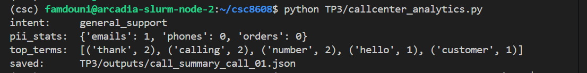

### Question 5.c
Extrait du JSON call_summary_call_01.json :

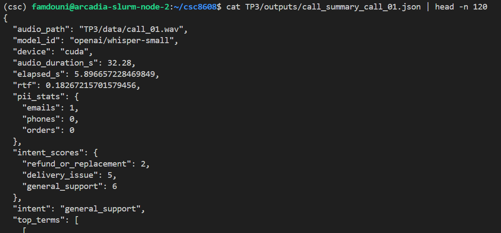
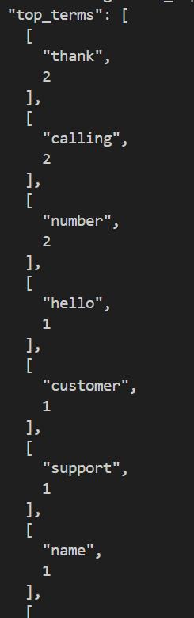

### Question 5.d

après les modifications :

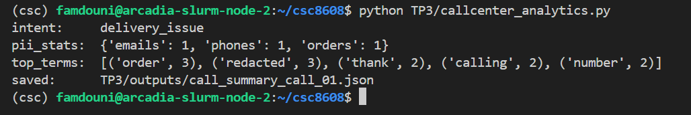

### Question 5.e

**Avant post-traitement :**
- `pii_stats` : `{'emails': 0, 'phones': 0, 'orders': 0}`
- Aucune PII détectée : l'email "john.smith at example.com", le numéro
  "5550199" et l'order "AX19735" étaient invisibles aux regex de base.

**Après post-traitement (version améliorée) :**
- `normalize_spelled_tokens` convertit "dot" → `.` et "at" → `@`, permettant de reconstruire `john.smith@example.com` → détecté
- `redact_order_id` étendu à "other number is" (erreur ASR fréquente) pour couvrir la transcription "the other number is AX19735" → détecté 
- `PHONE_RE` ajusté pour matcher "5550199" sans espace → détecté 
- Résultat final : `{'emails': 1, 'phones': 1, 'orders': 1}`

> Le post-traitement est volontairement heuristique. Il peut produire des faux positifs sur d'autres transcriptions, mais il est suffisant pour un premier prototype call center.

### Question 5.f : 

Les erreurs de Whisper les plus impactantes concernent les mots-clés d'intention et les PII. La plus critique est la transcription de "cracked" en "crooked" (segment 2) : ce mot-clé manqué fait chuter le score de `refund_or_replacement` à 2 au lieu de 3, alors que c'est l'intention réelle de l'appel. Le système a donc routé vers `general_support` (score 6) au lieu de `refund_or_replacement`, ce qui serait une erreur de routage grave en production. De même, "the other number is" (au lieu de "the order number is") a empêché la détection de l'order ID AX19735 sans post-traitement
contextuel. À l'inverse, les erreurs de politesse comme "thank you for your calling" (au lieu de "thank you for calling") sont peu critiques car elles n'affectent ni le routage ni la détection PII.

---

## Exercice 6 : TTS léger : générer une réponse “agent” et contrôler latence/qualité

### Question 6.a

### Question 6.b
```bash
python TP3/tts_reply.py
```

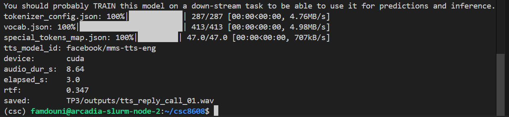

### Question 6.C
```bash
ffprobe TP3/outputs/tts_reply_call_01.wav
```

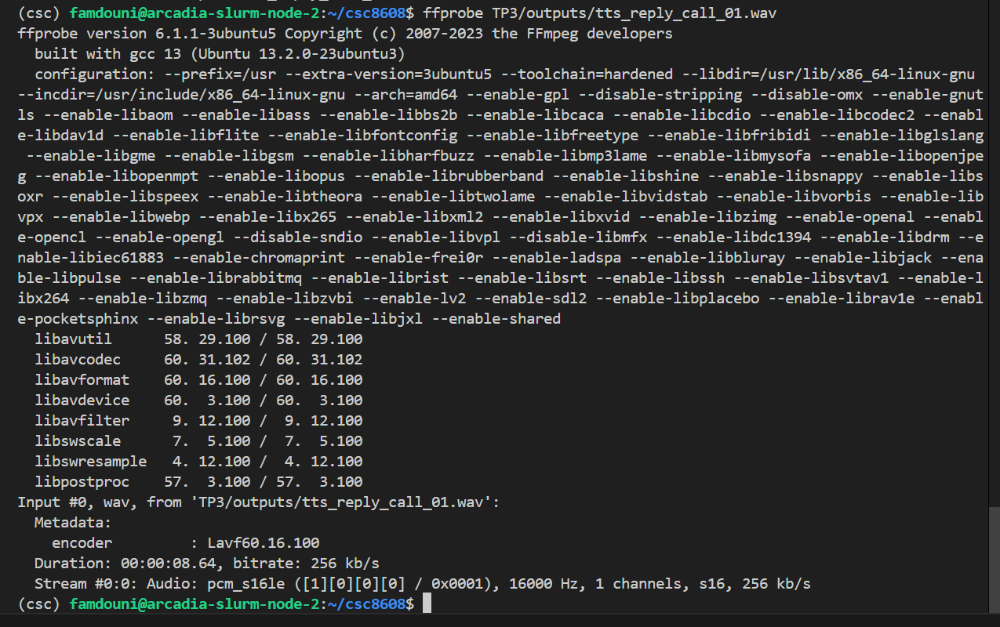

### Question 6.d

Le modèle `facebook/mms-tts-eng` produit une parole globalement intelligible, confirmée par le test ASR (Whisper retranscrit correctement la majorité du message). Cependant, deux erreurs de transcription révèlent des artefacts, "damaged" est rendu comme "arrived. Imaged" (coupure + mot fantôme) et "option" est transcrit "auction", indiquant une prosodie légèrement atypique sur certaines fins de mot. Le rythme est monotone mais acceptable.
Avec un RTF de **0.347** (standalone) et **0.08** (en cache pipeline), la génération est largement compatible avec un usage temps réel.

### Question 6.e

```bash
python TP3/asr_tts_check.py
```

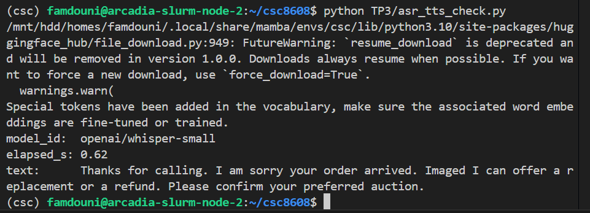

---

## Exercice 7 : Intégration : pipeline end-to-end + rapport d’ingénierie (léger)

### Question 7.a. 

### Question 7.b. 
```bash
python TP3/run_pipeline.py
```
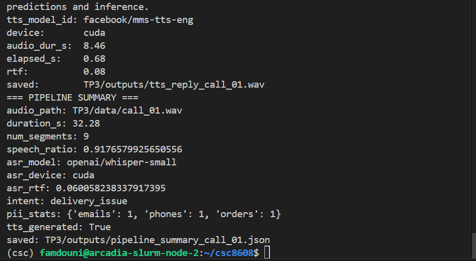

### Question 7.c. 

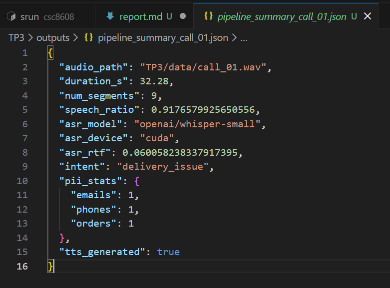

### Question 7.d. 

**Goulet d'étranglement principal :**
Au premier lancement, le TTS (3.0s pour 8.6s audio, RTF=0.347) représente l'étape la plus coûteuse proportionnellement. L'ASR Whisper, bien que plus lourd en paramètres, bénéficie du cache GPU et descend à RTF=0.06 en pipeline.
Le VAD reste négligeable (~<1s). En production sans cache, l'ASR redeviendrait le goulet principal (32s d'audio → charge GPU significative).

**Étape la plus fragile (qualité) :**
L'analytics (intent + PII) est la plus fragile car elle dépend entièrement de la qualité du transcript Whisper. Une seule erreur ASR — ici "cracked"→"crooked" ou "order"→"other" — suffit à faire rater un mot-clé critique et produire une mauvaise intention. Le pipeline a d'ailleurs détecté `delivery_issue`au lieu de refund_or_replacement` lors du premier run sans post-traitement,ce qui serait une erreur de routage grave en production.

**Deux améliorations concrètes sans réentraînement :**

1. **Fusion VAD des segments proches** (gap < 200ms) avant l'ASR : les   segments 4–7 découpent email et numéro de téléphone en 4 fragments, dégradant la transcription et la détection PII. Les fusionner préserve le contexte sémantique.
2. **Post-normalisation ASR étendue + scoring d'intention pondéré** :
enrichir le dictionnaire de corrections contextuelles ("other number"→ order number") et introduire des poids par mot-clé (ex: "refund" pèse plus que "thank you") pour rendre l'intent scoring plus robuste aux variantes ASR fréquentes.