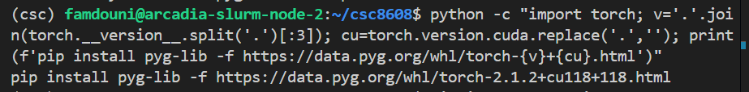
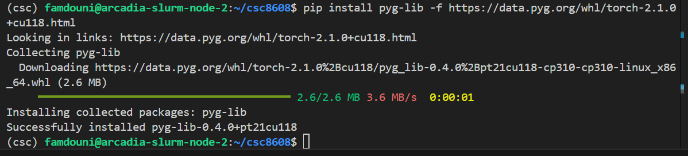
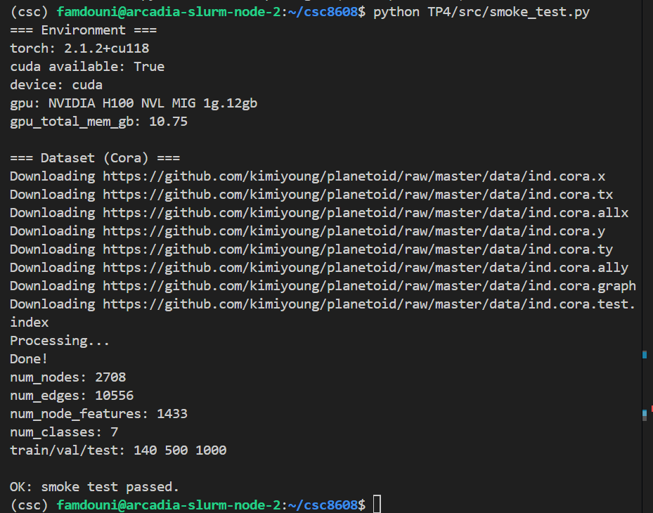
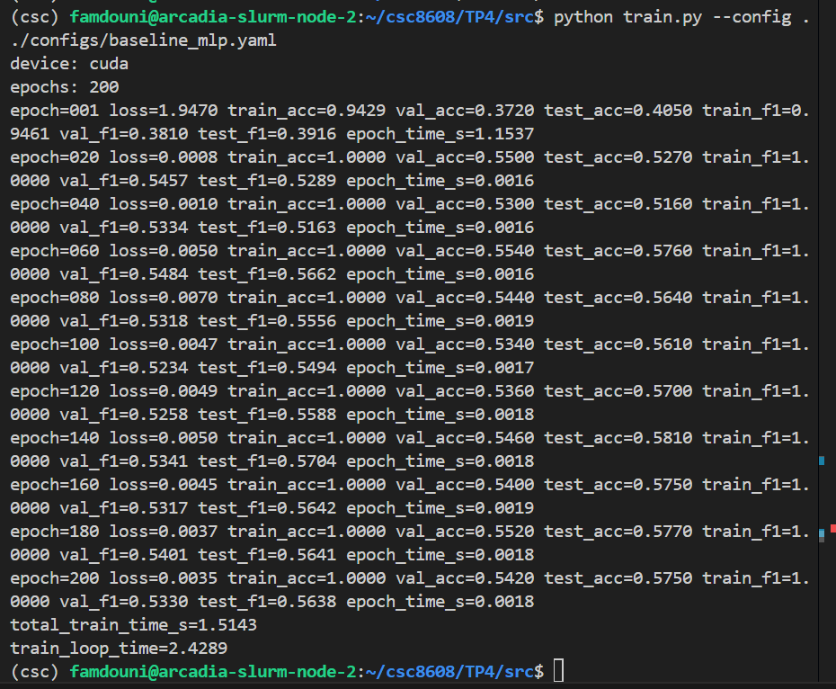
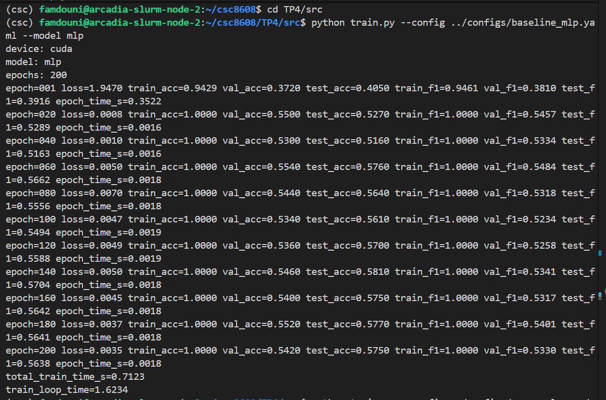
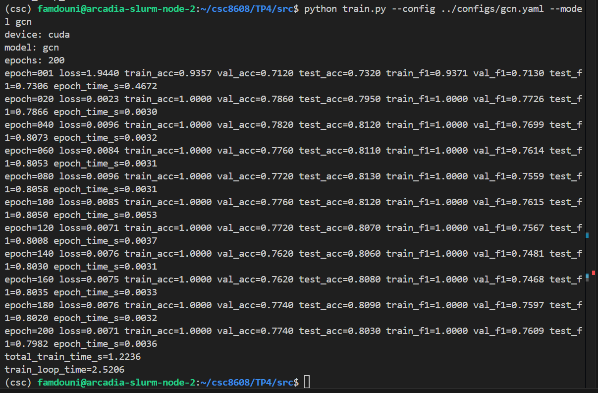
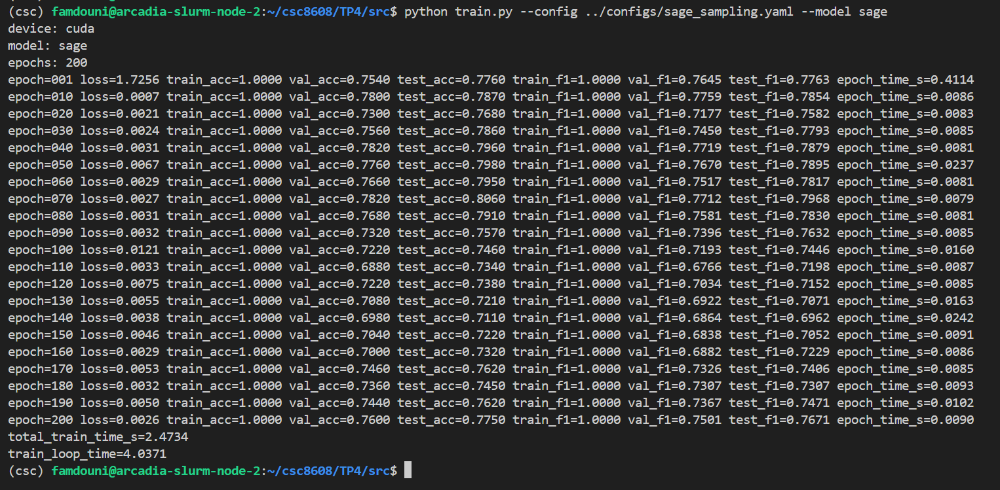
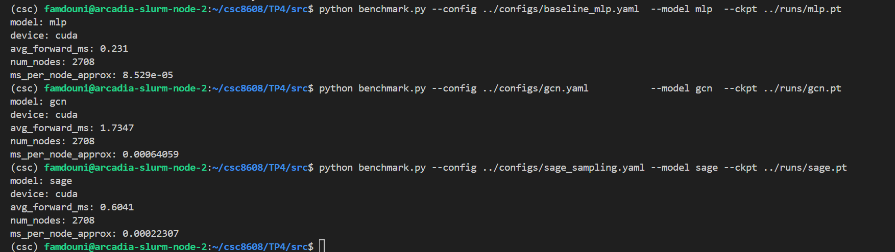

# CI : CI : Deep learning pour audio

---

## Exercice 1 : Initialisation du TP et smoke test PyG (Cora)

### Question 1.a : 

```
TP4/
├── rapport.md
├── configs/
│   ├── baseline_mlp.yaml
│   ├── gcn.yaml
│   └── sage_sampling.yaml
└── src/
    ├── smoke_test.py
    └── utils.py
```

### Question 1.b : Installation de PyTorch Geometric

```bash
pip install torch-geometric scipy
```

### Question 1.c :

La commande exécutée pour obtenir la ligne pip install adaptée à l'environnement :

```bash
python -c "import torch; v='.'.join(torch.__version__.split('.')[:3]); cu=torch.version.cuda.replace('.',''); print(f'pip install pyg-lib -f https://data.pyg.org/whl/torch-{v}+{cu}.html')"
```



La commande générée et exécutée : 
```bash
pip install pyg-lib -f https://data.pyg.org/whl/torch-2.1.0+cu118.html
```


### Question 1.d : Script smoke_test.py

`TP4/src/smoke_test.py`.

### Question 1.e : Résultat du smoke test

Exécution sur le cluster GPU (Slurm) :



---

## Exercice 2 : Baseline tabulaire : MLP (features seules) + entraînement et métriques

### Question 2.a. 

### Question 2.b. 

### Question 2.c. 

### Question 2.d. 

### Question 2.e. 

baseline_mlp.yaml :

```bash
seed: 42
device: "cuda"
epochs: 200
lr: 0.01
weight_decay: 5e-4
mlp:
  hidden_dim: 256
  dropout: 0.5
```

### Question 2.f. 

### Question 2.g. 

Les trois masques servent trois rôles distincts dans le protocole d'évaluation. `train_mask` permet de suivre si le modèle apprend (la loss baisse-t-elle ?) et de détecter un sous-apprentissage. `val_mask` sert à surveiller le surapprentissage en cours d'entraînement, si val_acc stagne pendant que train_acc monte, le modèle mémorise. `test_mask` donne la performance finale non biaisée, car il n'a jamais influencé aucun choix (ni d'hyperparamètre, ni d'arrêt). Utiliser le test set pour régler les hyperparamètres invaliderait la mesure, le modèle aurait vu indirectement ces nœuds, et la performance serait surestimée.

### Question 2.h.

```bash
cd TP4/src
python train.py --config ../configs/baseline_mlp.yaml
```


---

## Exercice 3 : Baseline GNN : GCN (full-batch) + comparaison perf/temps

### Question 3.a. 

gcn.yaml :

```bash
seed: 42
device: "cuda"
epochs: 200
lr: 0.01
weight_decay: 5e-4
gcn:
  hidden_dim: 256
  dropout: 0.5
```

### Question 3.b. 

### Question 3.c. 

### Question 3.d. 

### Question 3.e. : Comparaison MLP vs GCN

```bash
cd TP4/src

# MLP
python train.py --config ../configs/baseline_mlp.yaml --model mlp
# GCN
python train.py --config ../configs/gcn.yaml --model gcn
```



**Tableau comparatif :**

| Modèle | test_acc | test_f1 | total_train_time_s |
|--------|----------|---------|--------------------|
| MLP    | 0.5750   | 0.5638  | 0.71 s             |
| GCN    | **0.8030** | **0.7982** | 1.22 s         |

### Question 3.f. : Pourquoi GCN dépasse nettement le MLP sur Cora ?

Les résultats sont sans appel, GCN atteint **80.3% d'accuracy** contre **57.5% pour le MLP**, soit +22.8 points. Dès la première epoch, GCN affiche déjà 73.2% de test_acc là où le MLP stagne à 40.5%, ce qui montre que le signal du graphe est immédiatement utile.
Cora présente une forte **homophilie**, les articles citent majoritairement d'autres articles de la même sous-domaine. GCN exploite cette propriété via l'agrégation spectrale, chaque nœud lisse ses features avec celles de ses voisins directs (1-hop) puis de ses voisins à 2 sauts (2ème couche), propageant efficacement les labels des 140 nœuds supervisés vers les 2568 nœuds non labellisés. Le MLP, incapable d'exploiter les 10 556 arêtes, surapprend les 140 exemples d'entraînement (train_acc=1.0 dès epoch=20) sans généraliser. Le coût est modeste, GCN est seulement **1.7× plus lent** (1.22s vs 0.71s), ce qui est un excellent compromis performance/temps.

---

## Exercice 4 : Modèle principal : GraphSAGE + neighbor sampling (mini-batch)

### Question 4.a. 

sage_sampling.yaml : 
```bash
seed: 42
device: "cuda"
epochs: 200
lr: 0.01
weight_decay: 5e-4
sage:
  hidden_dim: 256
  dropout: 0.5
sampling:
  batch_size: 64
  num_neighbors_l1: 10
  num_neighbors_l2: 5
```

### Question 4.b. 

### Question 4.c.

### Question 4.d. 

### Question 4.e.
```bash
cd TP4/src
python train.py --config ../configs/sage_sampling.yaml --model sage
```
**Hyperparamètres de sampling :** 
- batch_size: 64 | num_neighbors: [10, 5]

**GraphSAGE (extraits log) :**



**Tableau comparatif :**

| Modèle    | test_acc       | test_f1        | total_train_time_s |
|-----------|----------------|----------------|--------------------|
| MLP       | 0.5750         | 0.5638         | 0.71 s             |
| GCN       | **0.8030**     | **0.7982**     | 1.22 s             |
| GraphSAGE | 0.7750 (0.8060 best) | 0.7671 (0.7968 best) | 2.47 s   |

### Question 4.f.

Le neighbor sampling (fanout [10, 5]) permet d'entraîner GraphSAGE en **mini-batch**, au lieu de charger tout le graphe comme GCN, on construit des sous-graphes locaux autour de 64 nœuds seeds, en échantillonnant au maximum 10 voisins au 1er hop et 5 au 2ème hop. Sur Cora (2708 nœuds), le gain mémoire est limité, mais la technique est indispensable sur des graphes à millions de nœuds où le full-batch est impossible.

Le **risque principal** est visible dans nos résultats : GraphSAGE atteint **80.6% à epoch=70**, puis **dégrade progressivement** jusqu'à 77.5% à epoch=200. C'est la signature directe de la **variance de gradient** due au sampling, chaque mini-batch voit un sous-ensemble aléatoire de voisins, ce qui rend l'optimisation plus bruitée et moins stable que GCN full-batch (80.3% stable). Les **nœuds hubs** (degree élevé) sont particulièrement affectés car leurs 10 voisins échantillonnés sur potentiellement 30+ introduisent une estimation biaisée de l'agrégation.

Enfin, un **coût CPU** s'ajoute, le NeighborLoader sample et construit les sous-graphes sur CPU avant transfert GPU, ce qui explique que GraphSAGE est **2× plus lent** que GCN (2.47s vs 1.22s) malgré des epochs GPU plus courtes (~0.009s vs ~0.003s). Ce surcoût CPU s'amortit sur de très grands graphes, où c'est le seul modèle viable.

---

## Exercice 5 : Benchmarks ingénieur : temps d’entraînement et latence d’inférence (CPU/GPU)

### Question 5.a. 

### Question 5.b. 

Commandes pour re-générer les checkpoints après la mise à jour de fichier train.py : 

```bash
cd TP4/src
python train.py --config ../configs/baseline_mlp.yaml --model mlp
python train.py --config ../configs/gcn.yaml --model gcn
python train.py --config ../configs/sage_sampling.yaml --model sage
```

### Question 5.c. 

### Question 5.d. 
Commandes d'exécution : 
```bash
cd TP4/src
python benchmark.py --config ../configs/baseline_mlp.yaml  --model mlp  --ckpt ../runs/mlp.pt
python benchmark.py --config ../configs/gcn.yaml           --model gcn  --ckpt ../runs/gcn.pt
python benchmark.py --config ../configs/sage_sampling.yaml --model sage --ckpt ../runs/sage.pt
```



**Tableau synthétique :**

| Modèle    | test_acc   | test_f1    | total_train_time_s | avg_forward_ms |
|-----------|------------|------------|--------------------|----------------|
| MLP       | 0.5750     | 0.5638     | 0.82 s             | **0.23 ms**    |
| GCN       | **0.8030** | **0.7982** | 0.72 s             | 1.73 ms        |
| GraphSAGE | 0.7360     | 0.7293     | 1.37 s             | 0.60 ms        |

> **Note :** La latence d'inférence est mesurée en full-batch sur les 2708 nœuds (100 runs, 10 warmup, synchronisation CUDA). `total_train_time_s` exclut l'évaluation inter-epoch (temps GPU pur des forward+backward entraînement).

### Question 5.e. 

Pourquoi warmup et synchronisation CUDA ?

Le GPU PyTorch fonctionne en **exécution asynchrone**, quand on appelle `model(x)`, le CPU soumet des kernels CUDA dans une file d'attente et reprend immédiatement la main sans attendre la fin du calcul GPU. Sans précaution, un chrono CPU mesurerait uniquement le temps de soumission des kernels (~quelques µs), pas le temps de calcul réel. C'est pourquoi on appelle `torch.cuda.synchronize()` **avant et après** chaque mesure, cela force le CPU à bloquer jusqu'à ce que tous les kernels GPU aient terminé, garantissant un vrai temps de mur (wall time).

Le **warmup** (10 itérations non mesurées) est indispensable pour deux raisons, **(1)** le premier appel déclenche la compilation JIT et l'allocation des buffers CUDA (cuBLAS/cuDNN choisissent leurs algorithmes optimaux), ce qui peut prendre 100× plus longtemps que les appels suivants, sur nos résultats, epoch=001 montre bien ce surcoût (MLP : 0.47s vs 0.0014s ensuite), **(2)** les caches GPU (L1/L2) et la mémoire partagée se stabilisent, rendant les 100 mesures suivantes représentatives du régime permanent. Sans warmup, la première mesure serait un outlier majeur qui biaiserait la moyenne vers le haut.

---

## Exercice 6 : Synthèse finale : comparaison, compromis, et recommandations ingénieur

### Question 6.a & 6.b : Tableau comparatif des trois modèles

| Modèle    | test_acc   | test_macro_f1 | total_train_time_s | train_loop_time | avg_forward_ms |
|-----------|------------|---------------|--------------------|-----------------|----------------|
| MLP       | 0.5750     | 0.5638        | 0.82 s             | 1.71 s          | 0.23 ms        |
| GCN       | **0.8030** | **0.7982**    | 0.72 s             | 1.62 s          | 1.73 ms        |
| GraphSAGE | 0.7360     | 0.7293        | 1.37 s             | 2.44 s          | 0.60 ms        |

> **Note :** `total_train_time_s` = somme des temps d'epoch GPU (forward+backward uniquement).
> `train_loop_time` = temps mur total incluant l'évaluation inter-epoch.
> `avg_forward_ms` = moyenne sur 100 runs full-batch avec warmup et synchronisation CUDA.

### Question 6.c : Recommandation ingénieur

**MLP** ne doit être choisi que si la structure du graphe est indisponible, non fiable, ou si la contrainte de latence est absolue (<0.25 ms ici). Avec seulement **57.5% de test_acc** contre 80.3% pour GCN, la perte de qualité est trop importante pour un cas où le graphe existe et est homophile. Il reste utile comme baseline de référence pour vérifier que le graphe apporte réellement de l'information.

**GCN** est le meilleur choix ici : il atteint **80.3% accuracy / 0.7982 Macro-F1** avec un `total_train_time_s` de seulement **0.72s**, soit le plus rapide des trois malgré une latence d'inférence de 1.73ms (7.5× le MLP). Ce surcoût est parfaitement acceptable en production sur un graphe statique de taille modérée. La stabilité de GCN full-batch est un avantage opérationnel.

**GraphSAGE** devient le bon choix dès que le graphe dépasse la mémoire GPU (millions de nœuds) ou que les nœuds/arêtes évoluent dynamiquement (nouveaux utilisateurs, flux en temps réel). Sur Cora, il souffre de l'instabilité du sampling (dégradation après epoch 70, test_acc finale 73.6% vs 80.3% GCN), mais sa latence d'inférence de **0.60ms**, 3× moins que GCN, et son paradigme mini-batch le rendent seul viable à grande échelle.

### Question 6.d : Risque de protocole pouvant fausser la comparaison

Le risque principal dans ce TP est l'**instabilité due à la seed et au sampling**.
GraphSAGE étant stochastique (voisins échantillonnés aléatoirement à chaque epoch), sa performance finale dépend fortement du run : sur nos deux exécutions, la test_acc finale varie entre 73.6% et 77.5% selon la seed et le scheduling CPU. Comparer un unique run GCN (déterministe) à un unique run GraphSAGE (bruité) avantage artificiellement GCN. Dans un vrai projet, on exécuterait **3 à 5 runs indépendants** avec des seeds différentes et on reporterait moyenne ± écart-type.

Un second risque est la **mesure non comparable CPU/GPU**, si le warmup est absent ou si `synchronize()` est oublié, les latences d'inférence sont sous-estimées pour les modèles GNN (qui soumettent plus de kernels) et la comparaison est biaisée en faveur du MLP. Enfin, le **caching PyG** lors du premier chargement de Cora peut inclure des téléchargements dans les temps mesurés si `PYG_DATA_ROOT` n'est pas pré-peuplé.

