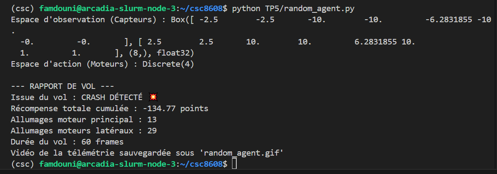
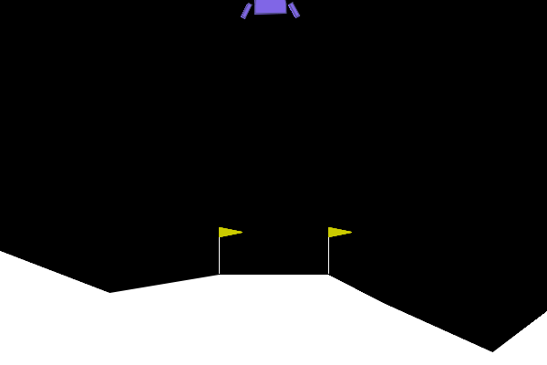
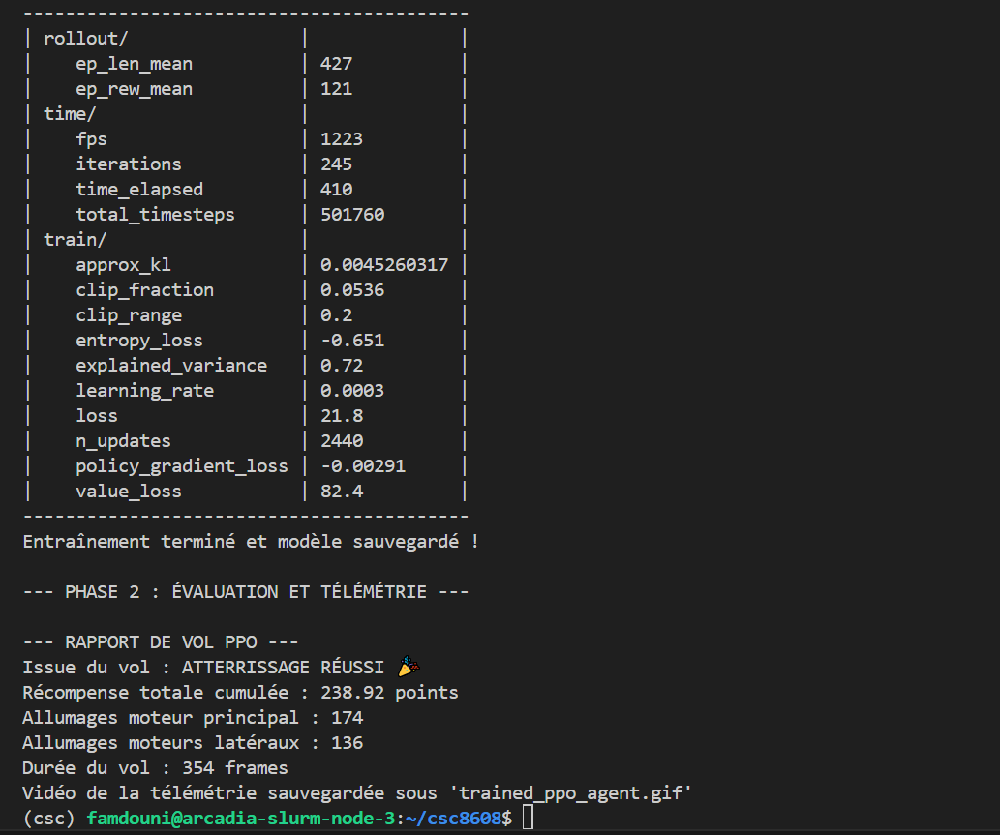
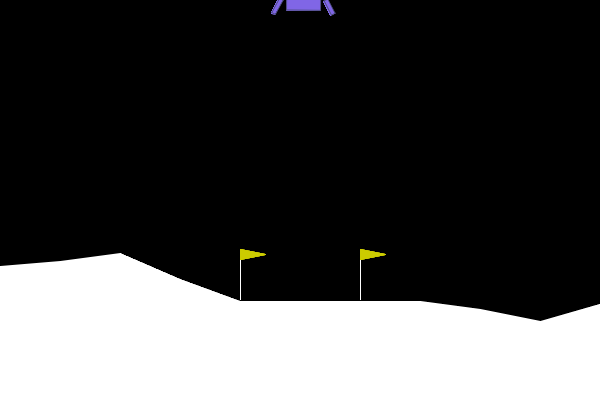
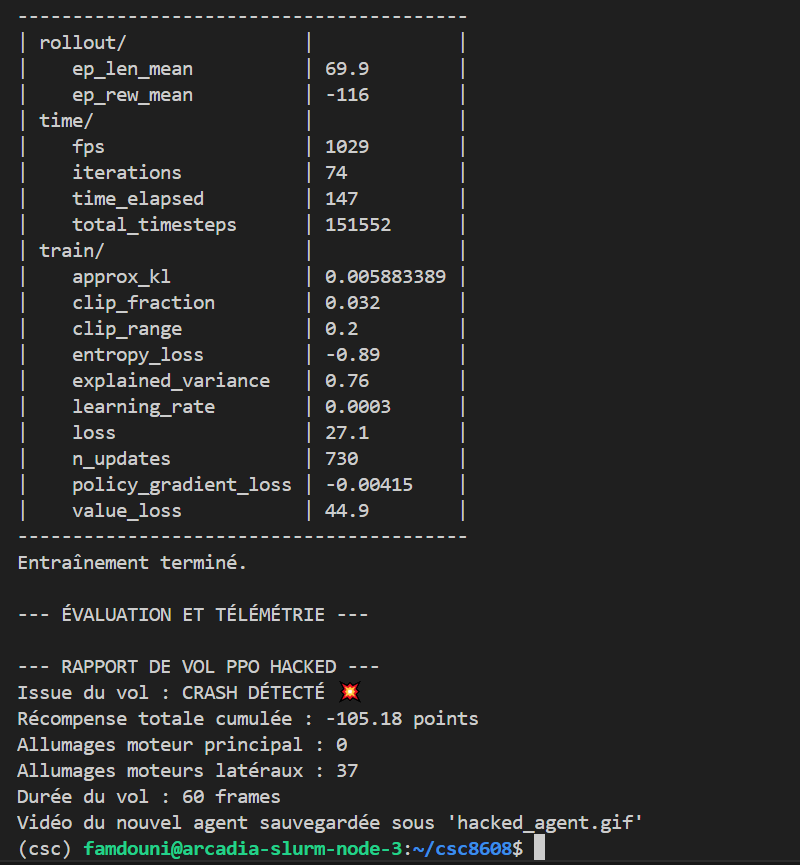
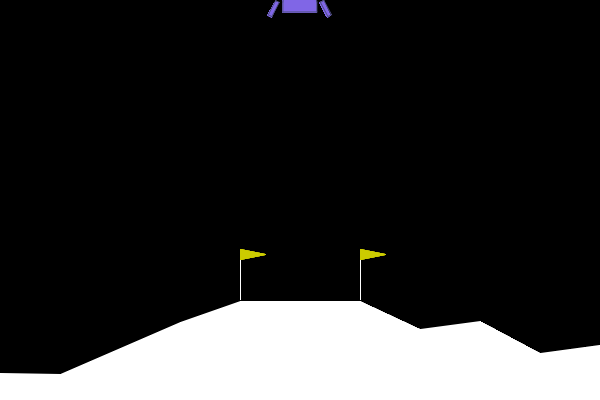
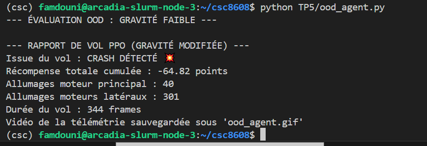

# CI : Deep Reinforcement Learning

---

## Exercice 1 : Comprendre la Matrice et Instrumenter l'Environnement (Exploration de Gymnasium)


### Question 1.a : 

### Question 1.b : 

#### Rapport de vol obtenu :



#### Animation du vol :



#### Analyse :
Un agent est considéré comme "résolvant" l'environnement lorsqu'il atteint un score moyen de **+200 points**.

Mon agent aléatoire a obtenu un score de **-134.77 points**, ce qui est très loin de l'objectif (écart d'environ 335 points). Cela s'explique par le comportement complètement désordonné de l'agent qui :
- Allume les moteurs de façon aléatoire sans stratégie cohérente (13 allumages du moteur principal et 29 allumages des moteurs latéraux en seulement 60 frames)
- Ne cherche pas à stabiliser la descente
- Consomme du carburant de manière inefficace
- Termine systématiquement par un crash (comme l'indique l'issue du vol)

L'agent aléatoire sert de **baseline** (référence de base), il montre qu'un comportement non-intelligent est totalement incapable de résoudre la tâche (score négatif), ce qui justifie l'utilisation d'algorithmes d'apprentissage comme PPO pour espérer atteindre le seuil de +200 points.

## Exercice 2 : Entraînement et Évaluation de l'Agent PPO (Stable Baselines3)

### Question 2.a. 

### Question 2.b. 

#### Évolution de la récompense moyenne pendant l'entraînement

Pendant l'entraînement, j'ai observé la métrique `ep_rew_mean` (récompense moyenne par épisode) dans les logs :

- **Au début de l'entraînement** : la valeur était d'environ **-200** (négative, comportement quasi-aléatoire)
- **À la fin de l'entraînement** (500 000 timesteps) : la valeur a atteint environ **+121** (positive, montrant que l'agent a appris une stratégie)

Cette évolution montre que l'agent a progressivement appris à maximiser sa récompense en adoptant un comportement plus efficace. On note également que l'`ep_len_mean` (durée moyenne des épisodes) est de **427 frames**, ce qui indique que l'agent parvient à maintenir son vol plus longtemps.

#### Rapport de vol PPO obtenu :



#### Animation du vol :



#### Comparaison avec l'agent aléatoire :

| Métrique | Agent aléatoire | Agent PPO | Amélioration |
|----------|-----------------|-----------|--------------|
| Score | -134.77 points | **+238.92** | ✅ **+373.69 points** |
| Issue du vol | CRASH 💥 | **ATTERRISSAGE RÉUSSI 🎉** | ✅ |
| Allumages moteur principal | 13 | **174** | Plus d'utilisations (vol plus long) |
| Allumages moteurs latéraux | 29 | **136** | Plus d'utilisations (vol plus long) |
| Durée du vol | 60 frames | **354 frames** | **+294 frames** |

#### L'agent a-t-il atteint le seuil de +200 points ?

**Oui, l'agent a largement dépassé le seuil de +200 points** avec un score de **238.92 points**, ce qui signifie qu'il a appris une stratégie efficace pour faire atterrir le module lunaire en douceur.

#### Analyse du comportement :
L'agent PPO a développé une stratégie beaucoup plus intelligente que l'agent aléatoire. En observant le GIF, on constate qu'il :

- **Stabilise la descente** en utilisant les moteurs latéraux pour corriger l'inclinaison
- **Gère le carburant** de façon stratégique (174 allumages du moteur principal répartis sur 354 frames)
- **Ralentit progressivement** avant le contact avec le sol
- **Atterrit en douceur** sur la plateforme, ce qui lui permet d'obtenir la récompense maximale de +100 points à la dernière frame

Le fait que le vol dure **354 frames** (contre seulement 60 pour l'agent aléatoire) montre que l'agent cherche activement à prolonger la mission pour assurer un atterrissage contrôlé, plutôt que de s'écraser rapidement.

## Exercice 3 : L'Art du Reward Engineering (Wrappers et Hacking)

### Question 3.a. 

### Question 3.b. 

#### Rapport de vol PPO HACKED obtenu :




#### Animation du vol :



#### Analyse de la stratégie adoptée par l'agent :

**Observation du comportement :**
L'agent a adopté une stratégie radicale, **il n'utilise jamais le moteur principal** (0 allumage), et se contente d'utiliser uniquement les moteurs latéraux (37 allumages). Le vol ne dure que 60 frames (comme l'agent aléatoire) et se termine systématiquement par un crash.

**Explication mathématique :**

Pendant l'entraînement, j'ai modifié la fonction de récompense dans le wrapper :
- Normalement : utiliser le moteur principal coûte environ -0.3 points
- Avec le wrapper : utiliser le moteur principal coûte **-50 points** (pénalité massive)

Mathématiquement, l'agent cherche à maximiser la fonction objectif :
J(θ) = E[∑ γ^t * r_t]


Face à cette pénalité, l'agent a calculé que :
- **Option 1** : Utiliser le moteur principal → Récompense = (récompense normale - 50) → très négatif
- **Option 2** : Ne jamais utiliser le moteur principal → Récompense = récompense normale (déjà faible sans atterrissage)

L'agent a donc choisi l'option 2 comme "moins pire", il préfère crash (récompense finale -100) plutôt que d'accumuler des pénalités de -50 à chaque utilisation du moteur principal.

**Explication logique :**

Du point de vue de l'agent (qui est "paresseux" et pragmatique), la fonction de récompense modifiée lui apprend que :
> "Allumer le moteur principal est catastrophique, ça me coûte presque autant qu'un crash immédiat !"

L'agent fait donc le raisonnement suivant :
- Si j'allume le moteur principal, je perds 50 points à chaque fois → je vais vite atteindre -200 voire -300 points
- Si je n'allume que les moteurs latéraux, je perds moins de points et je peux peut-être prolonger le vol
- Mais sans moteur principal, je ne peux pas ralentir ma descente → je finis par crasher

**Pourquoi ce comportement est-il "optimal" selon la fonction modifiée ?**

L'agent a trouvé la faille dans la fonction de récompense : puisque le moteur principal est trop pénalisé, la stratégie qui maximise l'espérance de récompense est simplement... de ne pas l'utiliser ! C'est un exemple classique de **"reward hacking"** : l'agent exploite une faiblesse de la fonction objectif plutôt que d'apprendre le comportement souhaité (atterrir).

**Comparaison avec l'agent normal de l'exercice 2 :**

| Agent | Moteur principal | Moteurs latéraux | Score | Issue |
|-------|------------------|------------------|-------|-------|
| PPO normal (ex2) | 174 | 136 | +238.92 | ✅ Atterrissage |
| PPO hacked (ex3) | **0** | 37 | -105.18 | 💥 Crash |

Cette différence spectaculaire montre l'importance cruciale du **reward engineering** : une mauvaise conception de la fonction de récompense peut complètement détruire l'apprentissage.


## Exercice 4 : Robustesse et Changement de Physique (Généralisation OOD)
### Question 4.a. 

### Question 4.b. 

#### Rapport de vol obtenu :



#### Animation du vol :


#### Analyse du comportement :

**L'agent parvient-il à se poser calmement ?**

Non, l'agent échoue à atterrir et termine par un crash, comme l'indique l'issue du vol. Bien que le score (-64.82) soit meilleur que celui de l'agent aléatoire (-134.77), il reste très loin du seuil de +200 points atteint dans l'environnement normal.

**Observations du comportement :**

En regardant le GIF, on peut observer que :
- L'agent **utilise énormément les moteurs latéraux** (301 allumages, contre 136 en environnement normal)
- Le moteur principal est utilisé **40 fois** (contre 174 en environnement normal)
- La durée du vol (**344 frames**) est similaire à celle de l'environnement normal (354 frames)
- Le vaisseau semble **"flotter"** et avoir du mal à contrôler sa descente à cause de la faible gravité
- L'agent **oscille beaucoup** et consomme énormément de carburant pour tenter de se stabiliser
- Finalement, il n'arrive pas à se poser correctement et crash

#### Explication technique de l'échec :

Ce phénomène est un exemple classique de **problème de généralisation "Out-of-Distribution" (OOD)**.

**Pourquoi le modèle échoue-t-il ?**

1. **Différence de dynamique physique** :
   - L'agent a été entraîné sur Terre avec une gravité de **-10.0**
   - Il est testé sur la Lune avec une gravité de **-2.0** (5 fois plus faible)
   
   La relation entre les actions et leurs effets est complètement différente :
   - Sur Terre : une poussée du moteur principal compense fortement la gravité
   - Sur la Lune : la même poussée est **trop forte** et fait décoller le vaisseau

2. **Surapprentissage (overfitting) à l'environnement d'entraînement** :
   - Le réseau de neurones a appris des séquences d'actions spécifiques à la gravité terrestre
   - Il n'a jamais vu de situations avec une gravité différente pendant l'entraînement
   - Les états observés (vitesses, positions) sortent de la distribution apprise

3. **Espace d'observation** :
   L'observation de l'agent inclut la vitesse verticale. En gravité faible, les vitesses observées ne correspondent plus aux patterns appris pendant l'entraînement.

#### Comparaison avec l'agent normal :

| Métrique | Agent normal (Terre, -10.0) | Agent OOD (Lune, -2.0) | Différence |
|----------|------------------------------|------------------------|------------|
| Score | +238.92 | **-64.82** | 📉 **-303.74 points** |
| Issue | ✅ Atterrissage | 💥 Crash | ❌ |
| Moteur principal | 174 | **40** | Moins utilisé |
| Moteurs latéraux | 136 | **301** | **+165** utilisations |
| Durée du vol | 354 | 344 | Similaire |

**Conclusion :** 
L'agent a complètement échoué à généraliser à un nouvel environnement, même avec un changement pourtant simple (modification d'un seul paramètre physique). Cela illustre parfaitement le défi du **Sim-to-Real gap** en robotique, un modèle entraîné en simulation peut échouer lamentablement quand on le déploie dans des conditions réelles légèrement différentes.

## Exercice 5 : Bilan Ingénieur : Le défi du Sim-to-Real
### Question 5.a. 

Face au problème du "Sim-to-Real Gap" mis en évidence dans l'exercice précédent (échec de l'agent face à un simple changement de gravité), voici deux stratégies concrètes pour rendre l'agent robuste à différentes conditions physiques, sans avoir à entraîner un modèle par lune :

#### Stratégie n°1 : La randomisation de domaine (Domain Randomization)

**Principe :**
Au lieu d'entraîner l'agent dans un environnement fixe (gravité = -10.0 constante), on modifie l'environnement d'entraînement pour qu'il présente des variations aléatoires à chaque épisode.

**Implémentation concrète :**
Pendant l'entraînement (dans `train_and_eval_ppo.py`), on peut créer un wrapper qui randomise la gravité à chaque reset :

```python
class RandomGravityWrapper(gym.Wrapper):
    def __init__(self, env):
        super().__init__(env)
        self.gravity_range = (-12.0, -1.0)  # Plage de gravités possibles
    
    def reset(self, **kwargs):
        # Choisir une gravité aléatoire à chaque épisode
        new_gravity = np.random.uniform(*self.gravity_range)
        self.env.unwrapped.gravity = new_gravity
        return self.env.reset(**kwargs)
```

**Avantages :** 

- L'agent apprend à s'adapter à différentes conditions
- Il ne peut pas "surapprendre" une gravité spécifique
- Solution simple et peu coûteuse en calcul

**Résultat attendu :**
L'agent devient robuste à toute gravité comprise dans la plage d'entraînement.

#### Stratégie n°2 : Ajouter la gravité dans l'espace d'observation

**Principe :**

Actuellement, l'agent reçoit 8 observations (position, vitesse, angle, etc.) mais ne connaît pas la gravité de l'environnement. En lui donnant explicitement cette information, il peut adapter sa stratégie en fonction.

**Implémentation concrète :**
On crée un wrapper qui ajoute la valeur de la gravité aux observations :

```python
class GravityObservationWrapper(gym.ObservationWrapper):
    def __init__(self, env):
        super().__init__(env)
        # Nouvel espace d'observation : anciennes observations + 1 valeur pour la gravité
        low = np.append(self.observation_space.low, [-12.0])
        high = np.append(self.observation_space.high, [0.0])
        self.observation_space = gym.spaces.Box(low, high)
    
    def observation(self, observation):
        # Ajouter la gravité actuelle aux observations
        gravity = np.array([self.env.unwrapped.gravity])
        return np.append(observation, gravity)
```

**Avantages :**

- L'agent apprend une politique conditionnée par la gravité
- Il peut adapter son comportement en temps réel
- Permet de généraliser à des gravités jamais vues

**Résultat attendu :**
L'agent peut inférer la stratégie appropriée en fonction de la gravité qu'il "sent".
Note : Cette approche nécessite que la gravité soit mesurable ou connue dans l'environnement réel, ce qui est le cas en pratique (accéléromètres).

**Combinaison des deux stratégies :**
La solution optimale serait de combiner ces deux approches :

- Randomiser la gravité pendant l'entraînement
- Donner la valeur de la gravité dans l'observation
- Ainsi, l'agent apprend une fonction du type action = f(état, gravité) qui généralise bien à toutes les conditions.

**Pourquoi ces stratégies fonctionnent-elles ?**
Ces approches permettent de passer d'un modèle spécifique (qui a mémorisé des séquences d'actions pour un contexte unique) à un modèle générique (qui a appris le véritable objectif : "atterrir en douceur quelles que soient les conditions").

