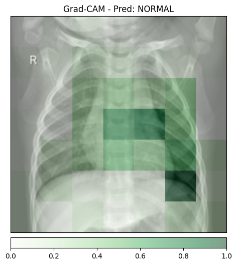
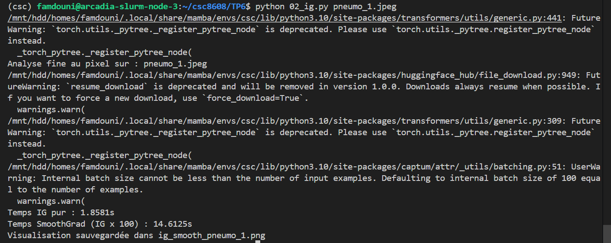
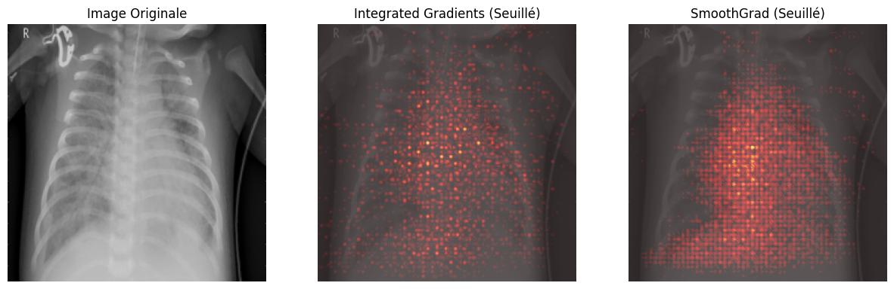
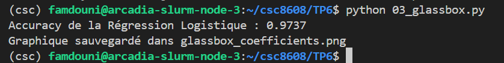
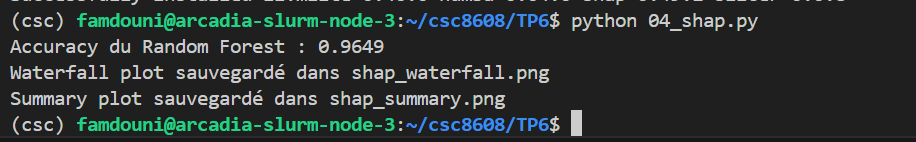
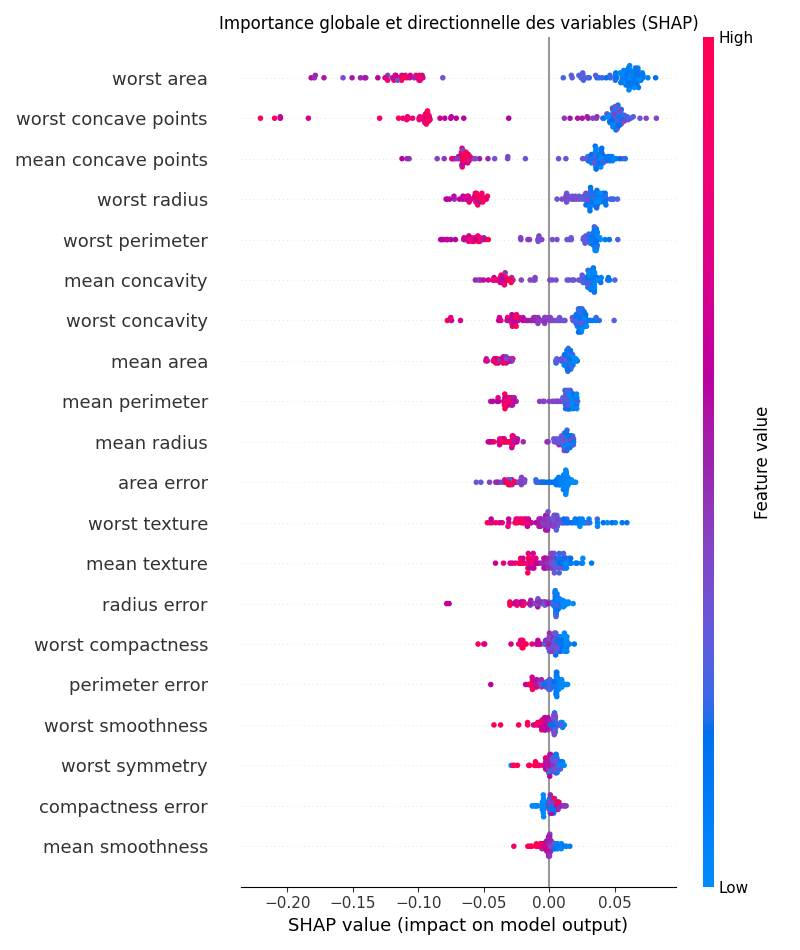

# CI : IA Explicable et Interprétable

---

## Exercice 1 :  Mise en place, Inférence et Grad-CAM

### Question 1.a : 

### Question 1.b : 

### Question 1.c : 

### Question 1.d : 

#### Images Grad-CAM générées :

**Image saine 1 (normal_1.jpeg) :**  

**Image saine 2 (normal_2.jpeg) :**  

**Image pneumonie 1 (pneumo_1.jpeg) :**  

**Image pneumonie 2 (pneumo_2.jpeg) :**  

#### Analyse des prédictions :

Le modèle a correctement classifié toutes les images :
- Images saines → **NORMAL**
- Images avec pneumonie → **PNEUMONIA**

Il n'y a donc pas de faux positifs à analyser dans ce cas.

#### Analyse des zones d'attention (Grad-CAM) :

En observant les heatmaps générées :

- **Images normales** : La zone rouge (là où le modèle regarde) est diffuse et répartie sur l'ensemble des poumons, sans zone particulièrement sur-activée. C'est cohérent avec une image saine où il n'y a pas d'anomalie spécifique à détecter.

- **Images avec pneumonie** : La zone rouge est beaucoup plus intense et localisée sur des zones spécifiques des poumons, notamment :
  - Pour pneumo_1 : la zone d'opacité caractéristique de la pneumonie est bien mise en évidence dans la partie centrale/inférieure du poumon
  - Pour pneumo_2 : la zone d'attention se concentre sur une région bien délimitée, probablement là où se trouve l'infiltration

#### Effet Clever Hans ?

En observant attentivement les heatmaps :
- Le modèle regarde bien **à l'intérieur des poumons** sur toutes les images
- Aucune attention particulière sur les **bords de l'image, les textes ou les marqueurs**
- Les zones activées correspondent anatomiquement aux régions pulmonaires

Le modèle n'a donc pas appris de biais "Clever Hans". Il se base sur des caractéristiques médicalement pertinentes, ce qui est rassurant pour une utilisation en milieu clinique.

#### Granularité de l'explication :

Les zones colorées sont **floues et en gros blocs**, pas des contours précis. On voit clairement que l'explication a une résolution faible (effet "pixelisé").

**Explication technique :**  
Grad-CAM utilise la **dernière couche convolutive** du ResNet. À ce niveau, la carte de caractéristiques (feature map) a une **résolution très réduite** (7x7 ou 14x14 pixels) à cause des couches de pooling successives (max pooling, average pooling). Quand on ré-échantillonne (interpolate) cette petite carte à la taille de l'image originale (224x224), on obtient forcément un résultat flou et "pixelisé". 

C'est la contrepartie d'avoir une explication rapide et sémantique, on perd en précision spatiale, mais on gagne en compréhension globale (le modèle regarde "la zone du poumon" plutôt que "tel pixel précis").

#### Temps de calcul :

| Image | Inférence | Grad-CAM | Ratio (Grad-CAM/Inférence) |
|-------|-----------|----------|----------------------------|
| normal_1 | 0.1135s | 0.3946s | **3.5x plus lent** |
| normal_2 | 0.0204s | 0.0641s | **3.1x plus lent** |
| pneumo_1 | 0.0204s | 0.0636s | **3.1x plus lent** |
| pneumo_2 | 0.0131s | 0.0428s | **3.3x plus lent** |

**Observation :** Grad-CAM est environ **3 fois plus lent** que la simple inférence, ce qui reste acceptable pour une analyse post-hoc. Le premier appel (normal_1) est plus lent à cause du "cold start" (initialisation du modèle en mémoire). Les appels suivants sont beaucoup plus rapides (environ 0.02s pour l'inférence et 0.05s pour Grad-CAM).

#### Conclusion :
Le modèle est non seulement performant (classification correcte), mais aussi **fiable** car il regarde les bonnes zones anatomiques. Les explications Grad-CAM confirment que son raisonnement est médicalement cohérent.

## Exercice 2 : Integrated Gradients et SmoothGrad
### Question 2.a.

### Question 2.b.

#### Image comparative générée :

#### Temps d'exécution relevés :

Temps IG pur : 1.8581s
Temps SmoothGrad (IG x 100) : 14.6125s

**Comparaison avec l'inférence classique :**
- Inférence (exercice 1) : environ **0.02s**
- IG pur : **1.86s** (environ **93 fois plus lent**)
- SmoothGrad : **14.61s** (environ **730 fois plus lent**)

#### Analyse de l'image générée :

En observant l'image comparative :

- **Integrated Gradients (milieu)** : On voit des activations précises mais très bruitées, avec plein de petits points rouges un peu partout. C'est difficile d'identifier clairement les zones importantes.

- **SmoothGrad (droite)** : Le bruit a été considérablement réduit. On distingue beaucoup mieux les contours des zones d'intérêt, avec des activations plus nettes et localisées. Le "lissage" a bien fonctionné.

- **Rouge vs Bleu** : Les zones rouges (positives) indiquent les pixels qui poussent vers la prédiction "PNEUMONIA". Les zones bleues (négatives) sont celles qui, au contraire, pousseraient vers "NORMAL" (le modèle les ignore ou les contre).

#### Analyse temps réel pour un médecin :

Peut-on générer cette explication de manière synchrone (temps réel) ?

Non, c'est technologiquement impossible en temps réel. Avec **14.6 secondes** pour une seule explication SmoothGrad, l'expérience utilisateur serait catastrophique (le médecin attendrait 15s après chaque clic). C'est beaucoup trop lent pour une utilisation interactive.

**Architecture logicielle proposée :**
> Mettre en place un système **asynchrone avec file d'attente** (RabbitMQ, Redis ou Celery), l'inférence rapide (0.02s) est faite en temps réel pour afficher le diagnostic immédiatement, tandis que l'explication détaillée est calculée en arrière-plan et stockée dans un cache ; si le médecin clique sur "Expliquer", on affiche l'explication pré-calculée si disponible, ou on la calcule à la demande avec un indicateur de chargement.

#### Avantage des valeurs négatives (comparé à Grad-CAM) :

Dans la visualisation, on observe deux couleurs :
- **Rouge/jaune** : pixels qui poussent **positivement** vers la classe prédite (PNEUMONIA)
- **Bleu** : pixels qui poussent **négativement** (ils vont à l'encontre de la prédiction, vers NORMAL)

**Avantage mathématique :**  
Contrairement à Grad-CAM qui applique un filtre ReLU (supprime toutes les influences négatives), Integrated Gradients conserve le **signe** des attributions. Cela permet de comprendre non seulement **ce qui a contribué à la décision**, mais aussi **ce qui a été ignoré ou contredit** par le modèle. 

Par exemple, sur cette image de pneumonie, les zones bleues correspondent probablement aux parties saines des poumons que le modèle a délibérément ignorées pour focus sur les zones infectées (en rouge). C'est une information précieuse pour vérifier que le modèle ne prend pas sa décision sur des artefacts et qu'il a bien appris à distinguer les zones saines des zones pathologiques.

#### Comparaison avec Grad-CAM :

| Critère | Grad-CAM | Integrated Gradients + SmoothGrad |
|---------|----------|-----------------------------------|
| Résolution | Floue (blocs) | **Précise au pixel près** |
| Signe | Positif seulement | **Positif et négatif** |
| Bruit | Propre (moyenné) | Bruité (d'où SmoothGrad) |
| Temps | Rapide (0.05s) | **Très lent (14.6s)** |
| Interprétation | "Où le modèle regarde" | "Quels pixels exactement et dans quel sens" |

#### Conclusion :
Integrated Gradients offre une explicabilité **beaucoup plus fine** que Grad-CAM, capable de dessiner les contours exacts des zones importantes. SmoothGrad est indispensable pour réduire le bruit et rendre l'explication lisible, mais multiplie le temps par 8 par rapport à IG pur, et par 730 par rapport à l'inférence. 

C'est le compromis classique en XAI, **précision vs rapidité**. En production, on utilise généralement Grad-CAM pour une explication rapide, et on réserve les méthodes pixel-précises pour des audits ponctuels ou des cas complexes.

## Exercice 3 : Modélisation Intrinsèquement Interprétable (Glass-box) sur Données Tabulaires

### Question 3.a. 

### Question 3.b. 

### Question 3.c. 

#### Image générée :

#### Performance du modèle :

Accuracy de la Régression Logistique : 0.9737

Le modèle atteint une excellente précision de **97.37%** sur le jeu de test, ce qui montre qu'une simple régression logistique bien normalisée peut déjà très bien performer sur ce problème de diagnostic du cancer du sein.

#### Analyse des coefficients :

En observant le graphique des coefficients (les barres horizontales) :

- **Les barres rouges** (négatives) poussent la prédiction vers la classe **0 = Maligne**
- **Les barres bleues** (positives) poussent vers la classe **1 = Bénigne**

**Caractéristique la plus influente pour la classe "Maligne" :**

La variable **"worst texture"** (texture la plus élevée) a le coefficient négatif le plus important (**-1.30**). Cela signifie que plus la texture de la tumeur est irrégulière (valeur élevée), plus le modèle est susceptible de prédire une tumeur maligne.

Viennent ensuite :
- **"radius error"** (-1.15) : l'erreur sur le rayon
- **"worst symmetry"** (-1.10) : la symétrie la plus élevée

Ces trois caractéristiques sont les biomarqueurs les plus importants pour détecter une tumeur maligne selon ce modèle linéaire.

#### Avantage d'un modèle directement interprétable :

**L'avantage majeur d'un modèle "glass-box" comme la régression logistique est que l'explication est intrinsèque et immédiate :** on peut comprendre exactement comment chaque caractéristique influence la prédiction en regardant simplement les coefficients, sans avoir besoin de méthodes post-hoc complexes comme Grad-CAM ou SHAP qui ajoutent du temps de calcul et de la complexité.

En d'autres termes, **le modèle est sa propre explication** : il n'y a pas de "boîte noire" à ouvrir.

#### Comparaison avec les exercices précédents :

| Approche | Modèle | Explicabilité | Temps | Complexité |
|----------|--------|---------------|------|------------|
| Ex1 & Ex2 | ResNet (images) | Post-hoc (Grad-CAM, IG) | Lent (secondes) | Élevée |
| Ex3 | Régression logistique | Intrinsèque (coefficients) | Immédiat | Faible |

**Conclusion :** Quand c'est possible (données tabulaires), il est toujours préférable de commencer par un modèle simple et interprétable. Les modèles complexes ne sont justifiés que s'ils apportent un gain de performance significatif par rapport à ces modèles "glass-box".

## Exercice 4 : Explicabilité Post-Hoc avec SHAP sur un Modèle Complexe

### Question 4.a. 

### Question 4.b. 

### Question 4.c. 

#### Performance du modèle :

Accuracy du Random Forest : 0.9649

Le Random Forest atteint une précision de **96.49%**, légèrement inférieure à la régression logistique (97.37%). Cela montre que sur ce jeu de données, un modèle linéaire bien normalisé peut être aussi performant qu'un modèle complexe, voire meilleur.

#### Images générées :

**Explicabilité Globale - Summary Plot :**

**Explicabilité Locale - Waterfall Plot (Patient 0) :**

#### Explicabilité Globale - Analyse du Summary Plot :

Le summary plot SHAP montre pour chaque caractéristique :
- **Position horizontale** : impact sur la prédiction (droite = vers Bénigne, gauche = vers Maligne)
- **Couleur** : valeur de la caractéristique (rouge = élevée, bleu = faible)

**Top 3 variables les plus importantes (par ordre d'impact) :**

1. **worst area** (en haut) - impact très fort
2. **worst concave points** - impact fort
3. **mean concave points** - impact modéré

**Comparaison avec la régression logistique (Exercice 3) :**

| Rang | Régression Logistique (coefficients) | Random Forest (SHAP) |
|------|--------------------------------------|----------------------|
| 1 | worst texture (-1.30) | **worst area** |
| 2 | radius error (-1.15) | **worst concave points** |
| 3 | worst symmetry (-1.10) | **mean concave points** |

**Observation :** Les variables identifiées ne sont pas exactement les mêmes. La régression logistique mettait en avant "worst texture", tandis que SHAP donne le plus d'importance à "worst area". 

Cependant, on note que **ce sont toutes des caractéristiques liées à la taille et à la forme des cellules** (area, concave points, texture, radius), ce qui est cohérent avec la connaissance médicale : les tumeurs malignes ont tendance à être plus grosses, plus irrégulières et de texture plus hétérogène.

**Conclusion sur la robustesse :** Les biomarqueurs identifiés par les deux méthodes sont différents mais appartiennent à la même famille de caractéristiques morphologiques. Cela suggère que ces caractéristiques sont **robustes**, mais que les deux modèles ont appris des représentations légèrement différentes de la maladie.

#### Explicabilité Locale - Analyse du Waterfall Plot (Patient 0) :

Le waterfall plot montre pour un patient spécifique comment chaque caractéristique a contribué à la prédiction finale.

- **Valeur de base (expected value)** : E[f(X)] = **0.632**
- **Prédiction finale** : f(x) = **0.97**

**Caractéristique ayant le plus contribué à la prédiction :**

La variable **"worst area"** avec :
- Valeur pour ce patient : **677.9**
- Contribution positive : **+0.07**

Cela signifie que la valeur élevée de "worst area" (677.9) a poussé la prédiction vers la classe Bénigne (positive). Viennent ensuite "worst concave points" (+0.06) et "mean concave points" (+0.04).

#### Synthèse des deux approches d'explicabilité :

| Aspect | Régression Logistique (Glass-box) | Random Forest + SHAP (Post-hoc) |
|--------|-----------------------------------|--------------------------------|
| Modèle | Simple, linéaire | Complexe, non-linéaire |
| Explication | Intrinsèque (coefficients) | Post-hoc (SHAP) |
| Performance | 97.37% | 96.49% |
| Variables importantes | worst texture, radius error | worst area, worst concave points |
| Temps d'explication | Immédiat | Plus long (calcul SHAP) |

#### Conclusion :

Cet exercice montre qu'un modèle simple et interprétable peut être aussi performant qu'un modèle complexe sur ce jeu de données. Dans un contexte médical, où la confiance et l'interprétabilité sont cruciales, il serait donc préférable d'utiliser la régression logistique plutôt qu'un Random Forest, car :
1. Elle est **aussi performante** (voire meilleure)
2. Elle est **directement interprétable** sans outils supplémentaires
3. Les coefficients sont **stables et compréhensibles** par des médecins

SHAP reste néanmoins un outil puissant pour auditer des modèles complexes quand ils sont nécessaires (données plus complexes, non-linéarités fortes).